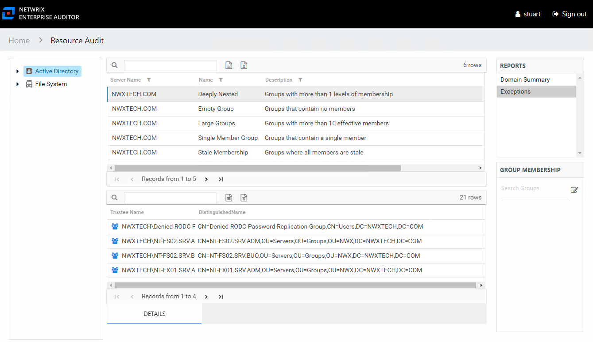

# Exceptions Report

The Exceptions report at the **Active Directory** node provides a list of exceptions that were found across the targeted Active Directory environment. This report includes a Details table.

An exception is defined as a problem or risk to Active Directory security. Exceptions include deeply nested groups and stale membership. This table will be blank if no exceptions were found within the targeted Active Directory environment. This report is comprised of the following columns:

* Server Name – Name of the Domain
* Name – Type of exception found
* Description – Description of the exception type
* Count – Number of this type of exception found on the targeted domains

There is one table at the bottom displaying Details for the selected exception:

* Trustee Name – Owner of the trustee account
* DistinguishedName – Distinguished name for the trustee account