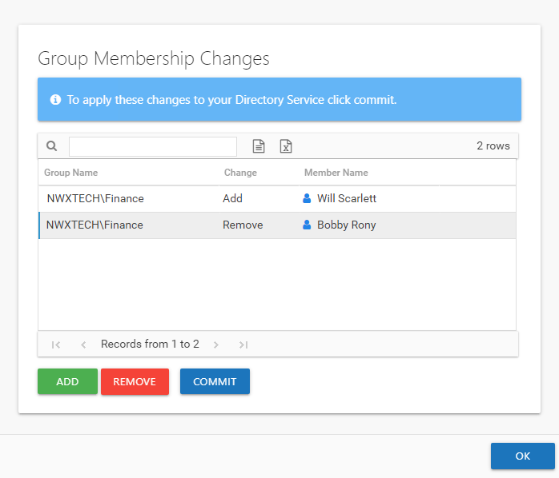

# Commit Modeled Changes

Once all changes are decided upon, it is time to commit the modeled changes to Active Directory. This can be done manually by an organization’s IT team, or it can be automated by enabling the Access Information Center to commit changes in the targeted Active Directory environment.

The following user roles can commit changes:

* Administrators – This role can configure the Access Information Center to commit changes and can commit modeled changes. See the [Commit Active Directory Changes](../../Admin/AdditionalConfig/CommitChanges "Commit Active Directory Changes") topic for additional information.
* Security Team Members – This role can commit modeled changes, if the Access Information Center has already been configured to do so

**NOTE:** All users with access to the Resource Audit interface can model changes. The **Commit** button in the Group Membership Changes window is not available to users with the Reader role or owners with no assigned role. A resource owner can use the **Change Access** button in the Owner portal.

Return to the Group Membership Changes window to view the modeled changes by clicking the **Change Group Membership** button on the Group Membership pane.

Additional changes can be modeled using the **Add** and **Remove** buttons.

Manually Commit Changes

You can export the list of modeled changes as either a CSV or Excel file, which can be sent to your organization’s IT team. Select between the **CSV Export** and **Excel Export** buttons above the table. See the [Data Grid Features](../../../General/DataGrid "Data Grid Features") topic for additional information.

Access Information Center Automatically Commits Changes

If the Access Information Center has been configured to commit changes in Active Directory, then the **Commit** button is available at the bottom of the window.

Click **Commit**. The Action Running window opens while the changes listed in the table are pushed to the targeted domain. When the **Action completed successfully** message displays, click **Close**. The changes that were just committed are reflected immediately in the Resource Audit interface reports.