# Model Changes in the AIC

Follow the steps to model resource access changes for a single trustee or multiple trustees.

**Step 1 –** Navigate to a desired file system resource and select the **Effective Access** report in the Reports pane.

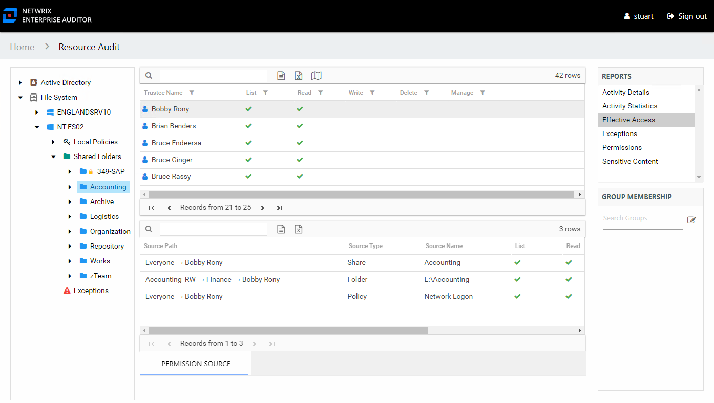

**Step 2 –** Select a trustee from the top table in the report. The Permission Source table displays the Source Path, or methods of access, to the selected resource. In this example, the trustee has access through three sources on policies, shares, and folders.

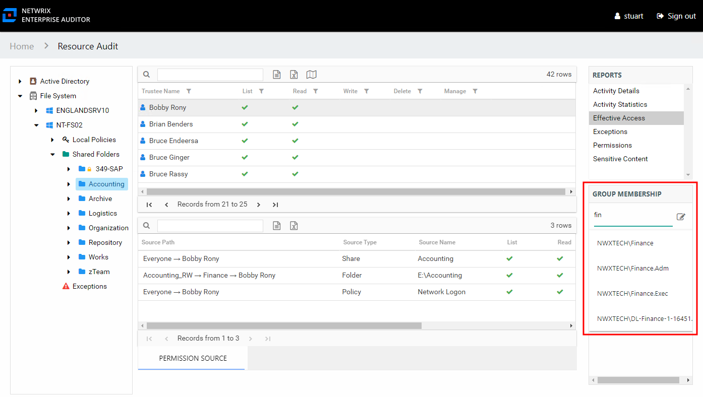

**Step 3 –** In the Group Membership pane, begin to enter the name of the group that grants the access to be changed. Select it from the list that shows in the drop-down menu. The group’s membership list opens.

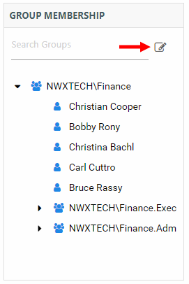

**Step 4 –** Click the **Change Group Membership** button on the Group Membership pane. The Group Membership Changes window opens.

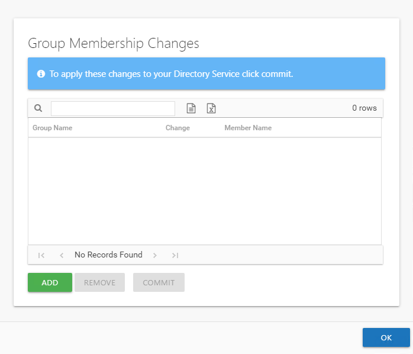

**Step 5 –** If this is the first change being modeled, the table is empty. If other changes are being modeled, they are listed in the table. Click **Add** to open the Add Membership Change wizard.

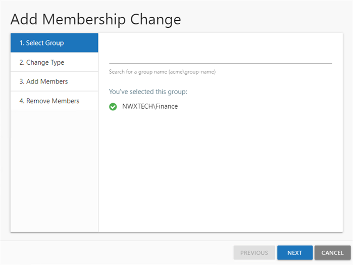

**Step 6 –** On the Select Group page, the selected group is displayed. You can search to select a different group. Click **Next**.

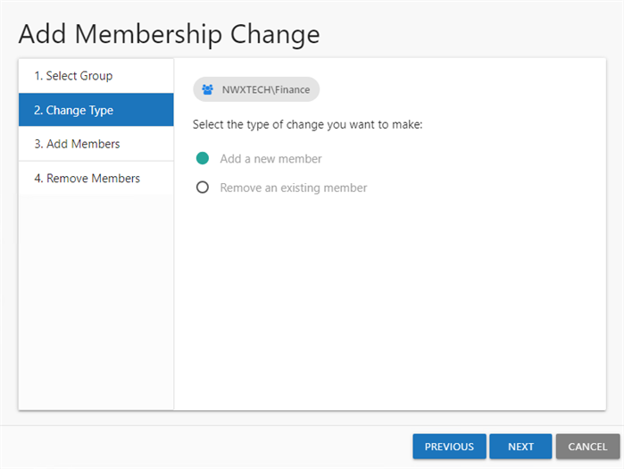

**Step 7 –** On the Change Type page, indicate the type of change to be modeled:

* Add a new member – Opens the Add Members page. If you select this option, proceed to Step 8.
* Remove an existing member – Opens the Remove Members page. If you select this option, skip to Step 10.

Click **Next**.

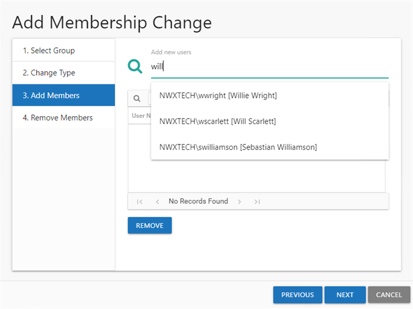

**Step 8 –** Begin to enter the trustee name in the search box. Available groups and users auto-populate in the drop-down menu. Select the desired trustee and the new member is added in the user list. Repeat as desired to add multiple members.

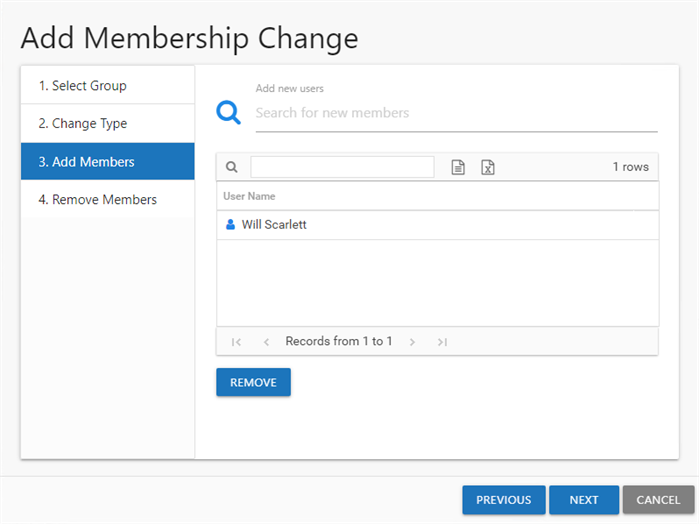

**Step 9 –** The members to be added are shown in the User Name table. Click **Next**. The Add Membership Change wizard closes, and the new members are listed on the Group Membership Changes window. Skip to Step 12.

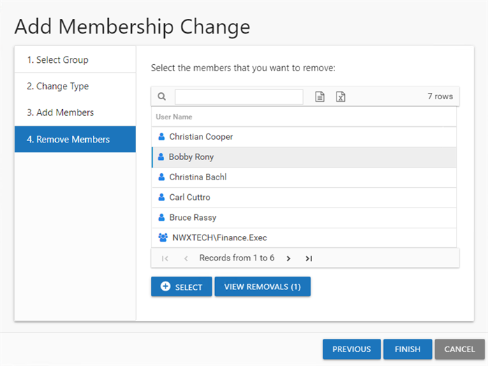

**Step 10 –** On the Remove Members page, the existing group members are listed. Select the desired members and click **Select**.

**NOTE:** The number on the **View Removals** button changes to reflect the number of users selected.

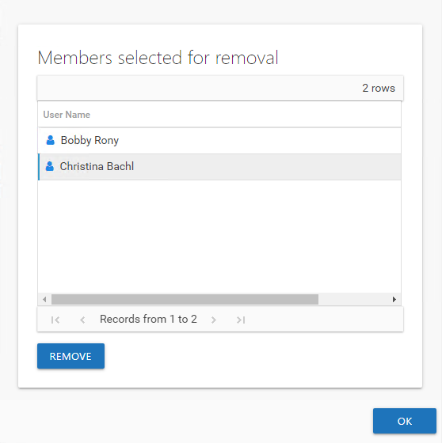

**Step 11 –** (Optional) Click **View Removals** to view the members selected for removal. To remove a member from this list, click **Remove** and then click **OK**.

**Step 12 –** The members selected for removal are shown in the User Name table. Click **Finish**. The Add Membership Change wizard closes, and the members to be removed are listed on the Group Membership Changes window.

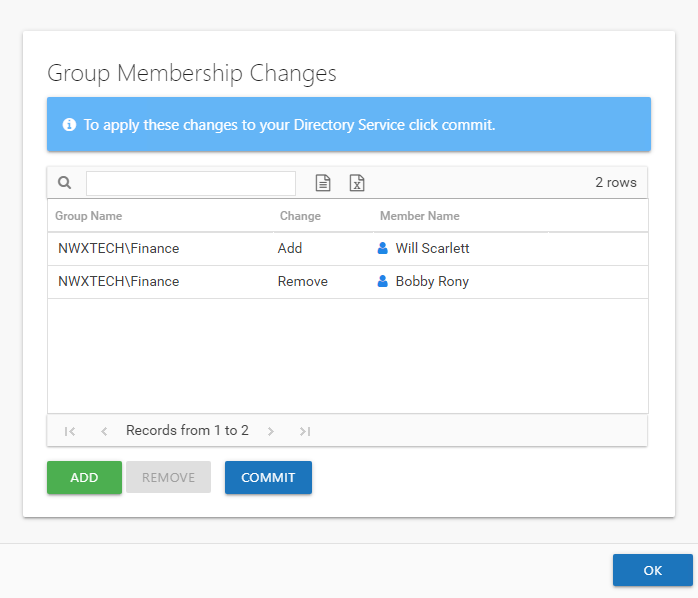

**Step 13 –** Repeat Steps 5-9 to model adding more members. Repeat Steps 5-7 and 10-11 to model removing more members. When the changes to be modeled are set as desired, click **OK**. The Group Membership Changes window closes.

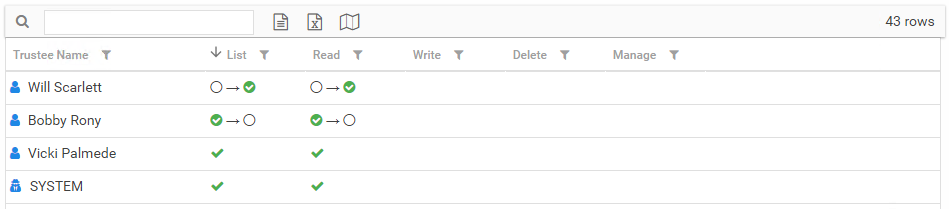

When the modeled changes impact the effective access for a trustee, it is displayed in the top section of the Effective Access report selected in Step 1. An illustration shows exactly how the modeled changes would impact a trustee’s access to the selected resource. It may take removing the trustee from multiple groups or adding the trustee to another group before access is modified as desired. View the global impact these changes will have on the trustee’s access to all organizational resources in the Modeled Access Changes report at the **File System** node level. See the [Modeled Access Changes Report](ModeledAccessChanges "Modeled Access Changes Report") topic for additional information.