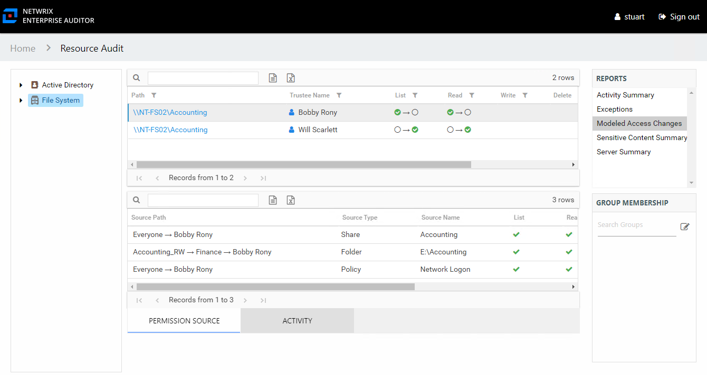
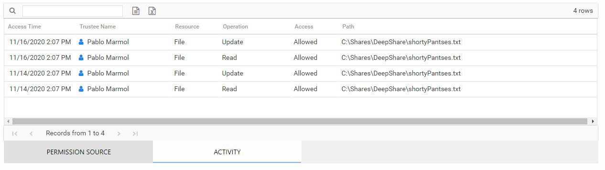

# Modeled Access Changes Report

The Modeled Access Changes report at the **File System** node provides an enterprise wide view of modeled access changes. This report is blank if no changes have been modeled or if the modeled changes have no impact on the environment. This report includes the following tables:

* Permission Source – Displays all of the ways the trustee has been granted rights to the resource
* Activity – Displays additional information on recent activity performed by the trustee which would have been impacted by the modeled change

This report is comprised of the following columns:

* Path – Location of the resource where the modeled change had an impact
* Trustee Name – Owner of the trustee account
* Trustee Account – Active Directory account associated with the trustee
* Department – Department to which the trustee account belongs
* Title – Trustee’s title as read from Active Directory
* Mail – Trustee’s email account as read from Active Directory
* EmployeeId – Corporate ID for the employee as read from Active Directory
* Description – Description of the trustee object as read from Active Directory
* DistinguishedName – Distinguished name for the trustee account
* ObjectSid – Security ID of the object
* Disabled – True or False if trustee account is disabled
* Deleted – True or False if trustee account is deleted
* Stale – True or False if trustee account is stale (according to the length of inactive time used by the Access Analyzer data collection and analysis configuration to identify stale accounts)
* Direct – True or False if the permission is directly assigned
* Impacted – True or False if recent activity would have been impacted by the modeled change. The activity must have occurred within the value set for the **ActivityDays** parameter in the **web.config** file. By default, this is set to 90 days. This feature requires the File System Activity Auditing (FSAC) collection jobs in Access Analyzer to be executed on a regular basis.

The following rights are a normalized representation of the Share and NTFS permissions granted to the trustee:

* List – Right to view list of files and subfolders
* Read – Right to view/read files and subfolders
* Write – Right to add or modify files and subfolders
* Delete – Right to delete files and subfolders
* Manage – Equivalent to full control over files and subfolders

There are two tables at the bottom displaying Permission Source and Activity for the selected resource.

## Permission Source Table

The Permission Source table contains all of the ways the trustee has been granted rights to the resource. The number of rows for this table indicates the number of ways this trustee would be granted access. This table is comprised of the following columns:

* Source Path – Location for which the trustee would be granted rights to the selected resource, which can be represented two ways:

  * Directly Applied – Rights would be granted directly to the selected trustee
  * Access through another trustee, path starts with trustee assigned the direct rights and shows all nested groups leading to the selected trustee
* Source Type – Share or folder source of the permission
* Source Name – Name of the resource where the permission is assigned

The following rights are a normalized representation of the Share and NTFS permissions granted to the trustee:

* List – Right to view list of files and subfolders
* Read – Right to view/read files and subfolders
* Write – Right to add or modify files and subfolders
* Delete – Right to delete files and subfolders
* Manage – Equivalent to full control over files and subfolders

The following columns display the combined direct and inherited rights:

* Allow Mask – Bitmask corresponding to Windows ACE permission bits for combined direct and inherited allow rights
* Deny Mask – Bitmask corresponding to Windows ACE permission bits for combined direct inherited deny rights

## Activity Table

The Activity table contains additional information on recent activity performed by the trustee which would have been impacted by the modeled change. Activity data displays local time stamps. This table will be blank if any of the following are true:

* Activity is not being monitored for the targeted environment
* The FSAC jobs within Access Analyzer have not been run
* There were no operation events logged for the selected trustee

This table is comprised of the following columns:

* Access Time – Date and timestamp for when the operation occurred
* Trustee Name – Name of the trustee
* Trustee Account – Active Directory account associated with the trustee
* Department – Department to which the trustee account belongs
* Title – Trustee’s title as read from Active Directory
* Mail – Trustee’s email account as read from Active Directory
* EmployeeId – Corporate ID for the employee as read from Active Directory
* Description – Description of the trustee object as read from Active Directory
* DistinguishedName – Distinguished name for the trustee account
* ObjectSid – Security ID of the object
* Disabled – True or False if trustee account is disabled
* Deleted – True or False if trustee account is deleted
* Resource – Type of resource
* Operation – Type of operation performed on the file (read, add, update, delete, permission change, rename)
* Access – Whether the trustee was granted access to execute the operation: **Allowed** or **Denied**
* Path – Location of the file
* Target Path – New location if changed by the operation. Blank if the operation does not result in a new path.
* Process Name – Name of the process which performed the operation