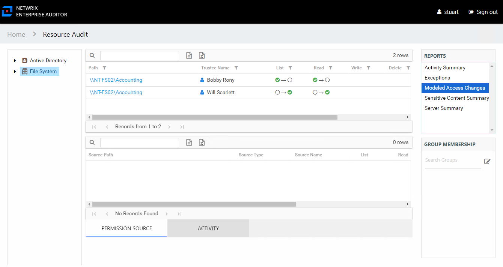

# Change Modeling

The Access Information Center includes a feature to model changes to resource access and group membership. This allows Access Information Center users to see what steps must be taken to adjust access or group membership, and see what impact these changes would have on access across the targeted file systems.

The change modeling process is a feature of the Group Membership pane. You should begin by reviewing a trustee's effective access to a File System resource in [Effective Access Report](../FileSystem/ShareSubfolder/EffectiveAccess "Effective Access Report") at the share and subfolder levels. Then use the Group Membership pane Changes feature to model the changes for the selected resource. Finally, review the changes across the entire File System environment in the [Modeled Access Changes Report](ModeledAccessChanges "Modeled Access Changes Report") at the **File System** node. See the [Model Changes in the AIC](Model "Model Changes in the AIC") topic for detailed instructions on this process.