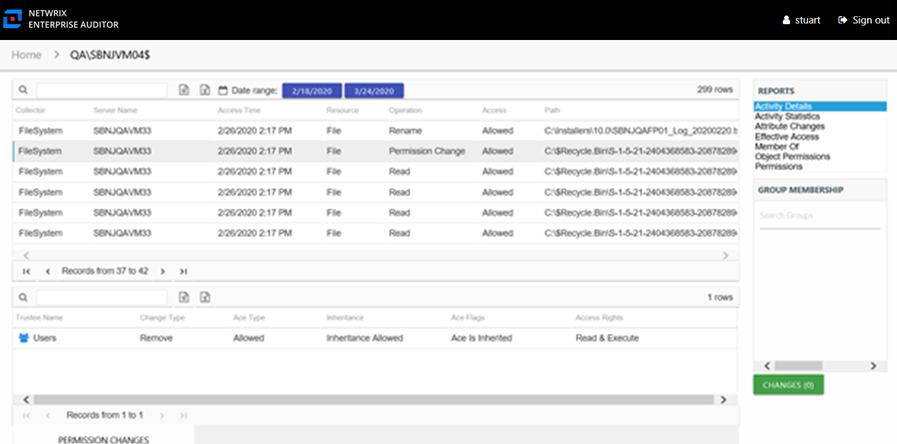

# Activity Details Report

The Activity Details report for a computer object provides details on every activity event logged by the audited computer during the selected date range. This report includes a Permission Changes table.

This report is comprised of the following columns:

* Collector – Refers to the collection source for the permission (for example, **FileSystem** for the Access Analyzer File System Solution, **SharePoint** for the Access Analyzer SharePoint Solution, and so on)
* Server Name – Name of the file system server or SharePoint farm/instance where the activity event occurred
* Access Time – Date and timestamp for when the operation occurred
* Resource – Resource type being accessed
* Operation – Name of operation logged
* Access – Whether the trustee was granted access to execute the operation: **Allowed** or **Denied**
* Path – Original location where the operation occurred
* Target Path – New location if changed by the operation. Blank if the operation does not result in a new path.
* Process Name – Name of the process which performed the operation
* Originating Address – IP Address of the NAS host from where the activity event originated. Blank if the operation originated on a Windows host.

There is one table at the bottom displaying Permission Changes for the selected event. It contains details on the trustee whose permissions were updated, added, or removed. This table is comprised of the following columns:

* Trustee Name – Trustee whose permissions were modified
* Trustee Account – Active Directory account associated with the trustee
* ObjectSid – Security ID of the object
* Change Type – Type of change that occurred:

  * Add – Permission added to trustee
  * Remove – Permission removed from trustee
  * Update – Permission modified for trustee
* Ace Type – Whether or not the right assigned is allowed or denied
* Inheritance – Whether or not the Ace is inherited
* Ace Flags – Inheritance flag description
* Access Rights – Type of right assigned