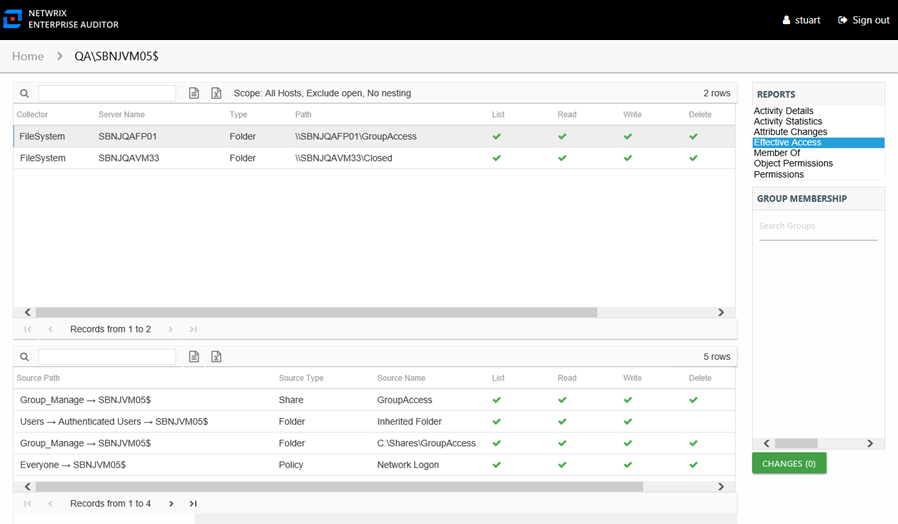
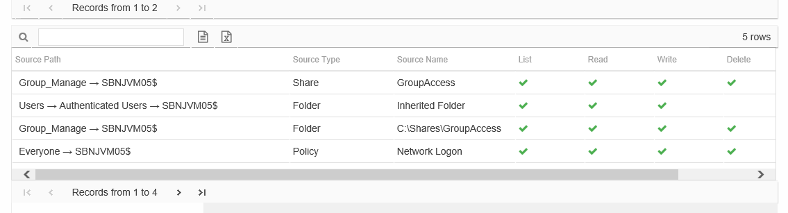

# Effective Access Report

The Effective Access report for a computer object provides insight into every resource the audited computer has access to and what level of access has been granted. Effective access is a calculation based on several variables according to the type of resource. This report includes a Permission Source table.

See the [Effective Access Report](../FileSystem/ShareSubfolder/EffectiveAccess "Effective Access Report") topic for File Systems for additional information on the effective access calculations for file system resources. See the [Effective Access Report](../SharePoint/SiteCollections/EffectiveAccess "Effective Access Report") topic for SharePoint for additional information on the effective access calculations for SharePoint resources.

This report contains a list of all resources the audited computer has the ability to access within the targeted environments. When this report is opened, the Access Information Center begins analyzing all of the collected data available for all access points. While the report data is loading, there is a status bar in the upper-right corner of the Reports pane that indicates the data loading progress. After the data has loaded, the number of rows is displayed.

**NOTE:** This report continues to load while other reports are being opened and viewed. As long as the Access Information Center user remains logged into the Access Information Center, it continues to load until all data has been analyzed for the audited user.

The scoping options allow Access Information Center users to specifying what collected data should be analyzed in order to generate this report. Unlike other filter options, this may impact the loading time depending on the scoping options selected. See the [Scope an Effective Access Report](../Navigate/ScopeEffectiveAccess "Scope an Effective Access Report") topic for instructions on using this feature.

This report is comprised of the following columns:

* Collector – Refers to the collection source for the permission (for example, **FileSystem** for the Access Analyzer File System Solution, **SharePoint** for the Access Analyzer SharePoint Solution, and so on)
* Server Name – Name of the file system server or SharePoint farm/instance where the permission is set
* Type – Type of resource where the permission is set
* Path – Location of the resource where the permission is set
* Open Access – True or False to indicate if access is granted through a high-risk trustee (for example, Everyone, Authenticated Users, or Domain Users)

The following rights are a normalized representation of the permissions granted to the computer:

* List – Right to view list of resources
* Read – Right to view/read resources
* Write – Right to add or modify resources
* Delete – Right to delete resources
* Manage – Equivalent to full control over resources

There is one table at the bottom displaying Permission Source for the select resource. It contains all of the ways the audited computer has been granted rights to the selected resource.

The number of rows for this table indicates the number of ways the audited computer has been granted access to selected resource. This table is comprised of the following columns:

* Source Path – Location for which the audited object was granted rights to the selected resource, which can be represented two ways:

  * Directly Applied – Rights granted directly to the audited object
  * Access through another trustee, path starts with trustee assigned the direct rights and shows all nested groups leading to the audited object
* Source Type – Source of the permission (for example, Share, Folder, Site Permission, Web Application Policy, and so on)
* Source Name – Name of the resource where the permission is assigned

The following rights are a normalized representation of the permissions granted to the computer:

* List – Right to view list of resources
* Read – Right to view/read resources
* Write – Right to add or modify resources
* Delete – Right to delete resources
* Manage – Equivalent to full control over resources

The following columns display the combined direct and inherited rights:

* Allow Mask – Bitmask corresponding to Windows ACE permission bits for combined direct and inherited allow rights
* Deny Mask – Bitmask corresponding to Windows ACE permission bits for combined direct inherited deny rights