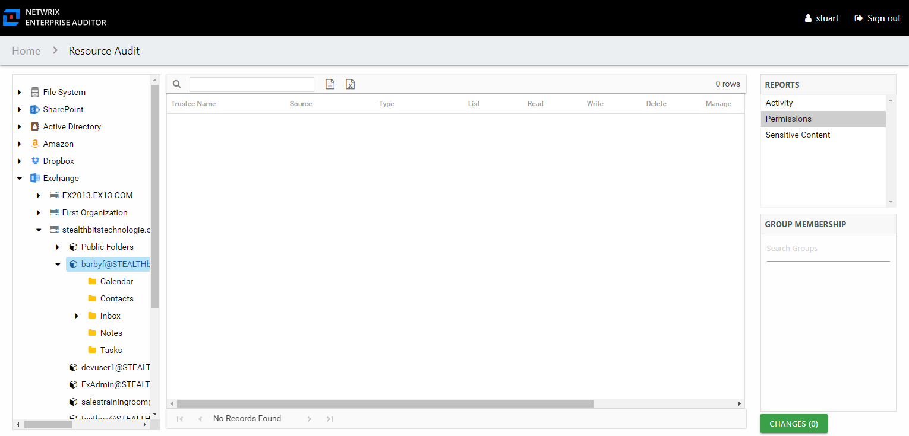

# Permissions Report

The Permissions report at the mailbox and folder level shows the permissions for the trustee on the selected resource.

This report is comprised of the following columns:

* Trustee Type – Type of the trustee (for example, Domain User or Domain Group)
* Trustee Name – Owner of the trustee account
* Trustee Account – Active Directory account associated with the trustee
* Department – Department to which the trustee account belongs
* Title – Trustee’s title as read from Active Directory
* Mail – Trustee’s email account as read from Active Directory
* EmployeeId – Corporate ID for the employee as read from Active Directory
* Description – Description of the trustee object as read from Active Directory
* DistinguishedName – Distinguished name for the trustee account
* ObjectSid – Security ID of the object
* Disabled – True or False if trustee account is disabled
* Deleted – True or False if trustee account is deleted
* Stale – True or False if trustee account is stale (according to the length of inactive time used by the Access Analyzer data collection and analysis configuration to identify stale accounts)
* Type – Direct or Inherited type of permission

The following rights are a normalized representation of the SQL permission levels (SQL Roles) granted to the trustee:

* List – Right to view list of resources
* Read – Right to view/read resources
* Write – Right to add or modify resources
* Delete – Right to delete resources
* Manage – Equivalent to full control over resources

The following columns display the combined direct and inherited rights:

* Allow Mask – Bitmask corresponding to Windows ACE permission bits for combined direct and inherited allow rights
* Deny Mask – Bitmask corresponding to Windows ACE permission bits for combined direct inherited deny rights