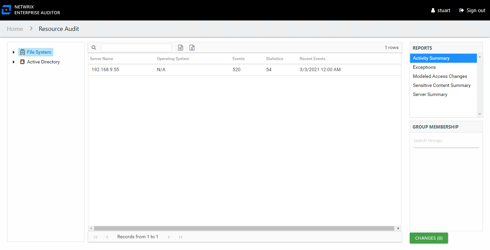

# Activity Summary Report

The Activity Summary report at the **File System** node provides an overview of activity performed on files and folders in each of the scanned servers. It reflects the total count of operations performed in each server, including operations in folders that are not shared. This activity report does not include a date range filter as it contains totals for all operations ever monitored by Access Analyzer for the targeted environment.

This report is comprised of the following columns:

* Server Name – Name of the server
* Operating System – Name of the server’s operating system
* Events – Total cumulative count of all operations events monitored for the server since the first scan
* Statistics – Roll-up information of the number of operations that have been performed by a trustee on a file or folder
* Recent Events – Date of the most recently scanned operations event