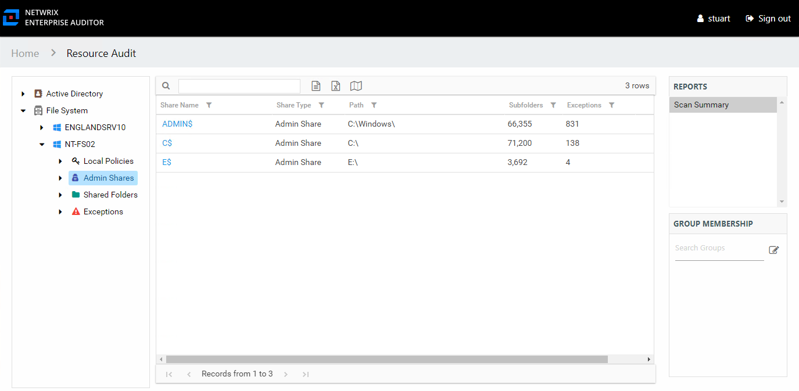

# Scan Summary Report

The Scan Summary report at the **Admin Shares** node provides a summary view of all shares on the server with the share type of Admin.

This report is comprised of the following columns:

* Share Name – Name of the share
* Share Type – Admin type of share, this report is filtered to exclude Shared type of shares
* Path – Location of the share
* Subfolders – Count of subfolders within the share
* Exceptions – Count of exceptions within the share