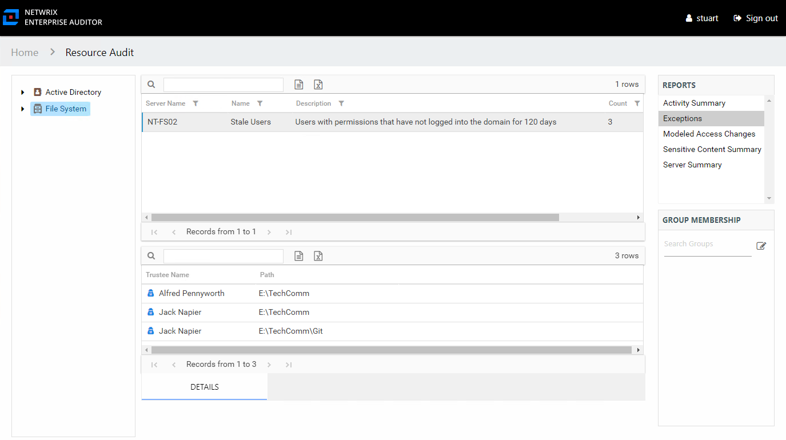

# Exceptions Report

The Exceptions report at the **File System** node provides a list of exceptions that were found across the targeted environment. This report includes a Details table.

An exception is defined as a problem or risk to data governance security. Exceptions include open shares and permissions granted to stale or disabled users. This table is blank if no exceptions were found within the targeted file systems. This report is comprised of the following columns:

* Server Name – Name of the server
* Name – Type of exception found
* Description – Description of the exception type
* Count – Number of this type of exception found on the server

There is one table at the bottom displaying Details for the selected exception:

* Trustee Name – Owner of the trustee account
* Path – Location of the resource where the exception existss