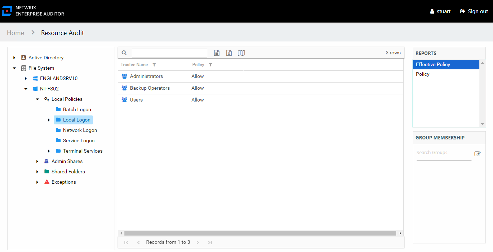

# Effective Policy Report

The Effective Policy report at the local policy level provides a list of users and groups who are effectively granted or denied access through the selected policy.

This report is comprised of the following columns:

* Trustee Name – Owner of the trustee account
* Trustee Account – Active Directory account associated with the trustee
* ObjectSid – Security ID of the object
* Policy – Allow or Deny access

If the selected trustee is a group, the Group Membership pane will display the group membership, including nested groups.