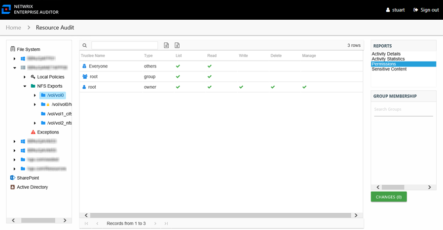

# Permissions Report

The Permissions report at the NFS Exports share and subfolder levels provides a list of trustees with permissions for the selected resource and access level for each trustee.

This report is comprised of the following columns:

* Trustee Name – Owner of the trustee account
* Trustee Account – Active Directory account associated with the trustee
* Trustee Sid – Security ID of the object
* Type – Direct or Inherited type of permission

The following rights are a normalized representation of the Share and NTFS permissions granted to the trustee:

* List – Right to view list of files and subfolders
* Read – Right to view/read files and subfolders
* Write – Right to add or modify files and subfolders
* Delete – Right to delete files and subfolders
* Manage – Equivalent to full control over files and subfolders
* Allow – Granular rights allowed through the Share and NTFS permissions