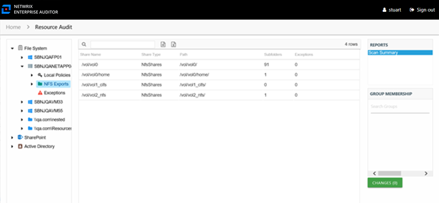

# Scan Summary Report

The Scan Summary report at the **NFS Exports** node provides a summary view of all shares on the server with the share type of Shared.

This report is comprised of the following columns:

* Share Name – Name of the share
* Share Type – Shared type of share, this report is filtered to exclude Admin type of shares (for example, C$)
* Path – Location of the share
* Subfolders – Count of subfolders within the share
* Exceptions – Count of exceptions within the share