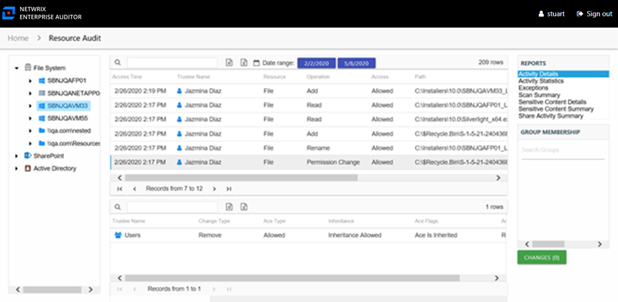

# Activity Details Report

The Activity Details report at the server level provides details on every operation logged during the selected date range. Activity on DFS Namespaces at this level is rolled up to the server hosting the DFS Namespace. This report includes a Permission Changes table.

This report is comprised of the following columns:

* Access Time – Date and timestamp for when the operation occurred
* Trustee Name – Owner of the trustee account
* Trustee Account – Active Directory account associated with the trustee
* Department – Department to which the trustee account belongs
* Title – Trustee’s title as read from Active Directory
* Mail – Trustee’s email account as read from Active Directory
* EmployeeId – Corporate ID for the employee as read from Active Directory
* Description – Description of the trustee object as read from Active Directory
* DistinguishedName – Distinguished name for the trustee account
* ObjectSid – Security ID of the object
* Disabled – True or False if trustee account is disabled
* Deleted – True or False if trustee account is deleted
* Resource – Resource type being accessed
* Operation – Name of operation logged
* Access – Whether the trustee was granted access to execute the operation: **Allowed** or **Denied**
* Path – Original location where the operation occurred
* Target Path – New location if changed by the operation. Blank if the operation does not result in a new path.
* Process Name – Name of the process which performed the operation

There is one table at the bottom displaying Permission Changes for the selected event. It contains details on the trustee whose permissions were updated, added, or removed. This table is comprised of the following columns:

* Trustee Name – Trustee whose permissions were modified
* Trustee Account – Active Directory account associated with the trustee
* ObjectSid – Security ID of the object
* Change Type – Type of change that occurred:

  * Add – Permission added to trustee
  * Remove – Permission removed from trustee
  * Update – Permission modified for trustee
* Ace Type – Whether or not the right assigned is allowed or denied
* Inheritance – Whether or not the Ace is inherited
* Ace Flags – Inheritance flag description
* Access Rights – Type of right assigned