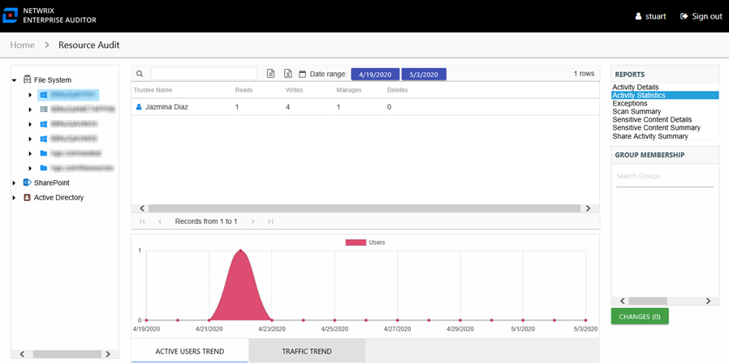
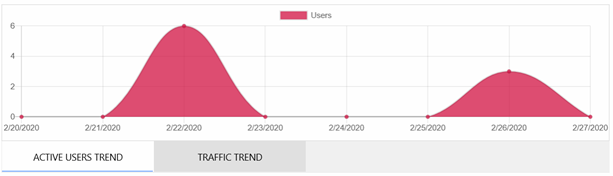
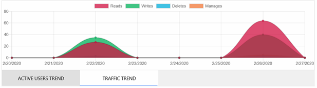

# Activity Statistics Report

The Activity Statistics report at the server level provides statistical activity event information by user on the selected server during the specified date range. Activity on DFS Namespaces at this level is rolled up to the server hosting the DFS Namespace. This report includes line graphs for Active Users Trend and Traffic Trend.

This report is comprised of the following columns:

* Trustee Name – Owner of the trustee account
* Trustee Account – Active Directory account associated with the trustee
* Department – Department to which the trustee account belongs
* Title – Trustee’s title as read from Active Directory
* Mail – Trustee’s email account as read from Active Directory
* EmployeeId – Corporate ID for the employee as read from Active Directory
* Description – Description of the trustee object as read from Active Directory
* DistinguishedName – Distinguished name for the trustee account
* ObjectSid – Security ID of the object
* Disabled – True or False if trustee account is disabled
* Deleted – True or False if trustee account is deleted
* Stale – True or False if trustee account is stale (according to the length of inactive time used by the Access Analyzer data collection and analysis configuration to identify stale accounts)
* Reads – Count of view/read operations on files and subfolders
* Writes – Count of edit/modify operations on files and subfolders
* Manages – Count of permission change operations on files and subfolders
* Deletes – Count of delete operations on files and subfolders

The table data grid functions the same way as other table grids. See the [Data Grid Features](../../../../General/DataGrid "Data Grid Features") topic for additional information.

There are two line graphs at the bottom displaying Active Users Trend and Traffic Trend for the selected resource.

The Active Users Trend line graph provides a visual representation of the number of active users over the selected date range. It indicates how many users are performing operations per day.

The Traffic Trend line graph provides a visual representation of the number of operations events that occurred by operation type over the selected date range. It indicates what volume of operations occurred per day. Each operation type is shown with a different color, as indicated by the legend.

See the [Activity Report Results Pane Features](../../Navigate/Overview#Activity "Activity Report Results Pane Features") topic for instructions on filtering the trend graphs.