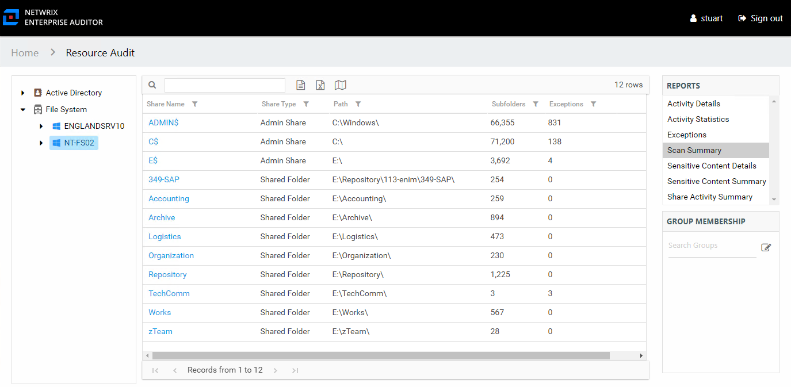

# Scan Summary Report

The Scan Summary report at the server level provides a summary view of all shares on the selected server.

This report is comprised of the following columns:

* Share Name – Name of the share
* Share Type – Admin or Shared type of share, an Admin share is a built-in share (for example, C$)
* Path – Location of the share
* Subfolders – Count of subfolders within the share
* Exceptions – Count of exceptions within the share