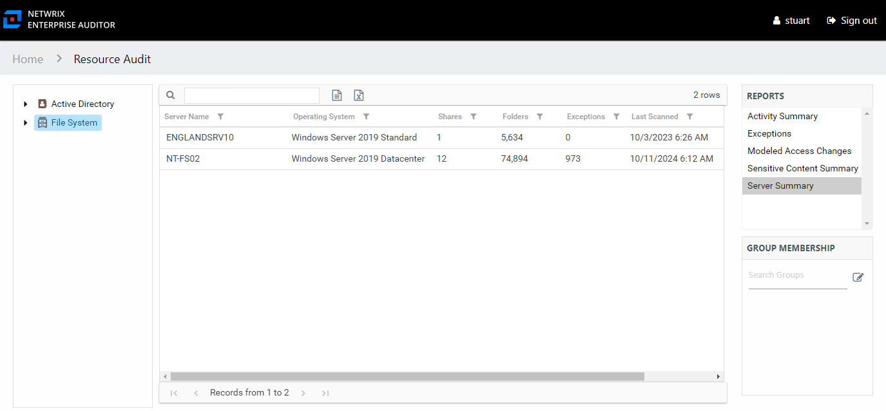

# Server Summary Report

The Server Summary report at the **File System** node provides a top-level view of servers that have been scanned.

This report is comprised of the following columns:

* Server Name – Name of the server
* Operating System – Name of the server’s operating system
* Shares – Count of shares on the server
* Folders – Count of folders on the server
* Exceptions – Count of exceptions on the server
* Last Scanned – Date and timestamp of the last Access Analyzer scan

Also, the Group Membership pane displays Local Administrator and Local Group membership on the selected server.