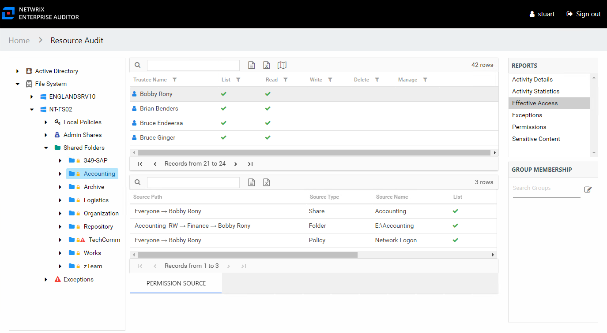
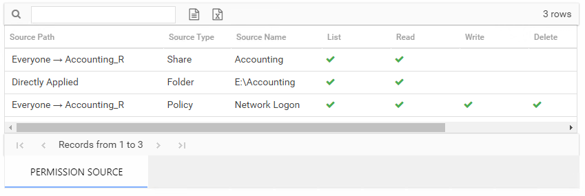

# Effective Access Report

The Effective Access report at the share and subfolder levels provides insight into who has what level of access to this resource through a calculation that encompasses server policies, share and folder permissions, and group membership. It contains a list of all trustees with access to the selected resource and specifies the effective access level. This report includes a Permission Source table.

This report is comprised of the following columns:

* Trustee Type – Type of the trustee (for example, Domain User or Domain Group)
* Trustee Name – Owner of the trustee account
* Trustee Account – Active Directory account associated with the trustee
* Department – Department to which the trustee account belongs
* Title – Trustee’s title as read from Active Directory
* Mail – Trustee’s email account as read from Active Directory
* EmployeeId – Corporate ID for the employee as read from Active Directory
* Description – Description of the trustee object as read from Active Directory
* DistinguishedName – Distinguished name for the trustee account
* ObjectSid – Security ID of the object
* Disabled – True or False if trustee account is disabled
* Deleted – True or False if trustee account is deleted
* Stale – True or False if trustee account is stale (according to the length of inactive time used by the Access Analyzer data collection and analysis configuration to identify stale accounts)
* Direct – True or False if the permission is directly assigned
* Changed – True or False if the trustee has changes modeled that would impact access to the selected resource

The following rights are a normalized representation of the Share and NTFS permissions granted to the trustee:

* List – Right to view list of files and subfolders
* Read – Right to view/read files and subfolders
* Write – Right to add or modify files and subfolders
* Delete – Right to delete files and subfolders
* Manage – Equivalent to full control over files and subfolders

If the selected trustee in the top section of the report is a group, the Group Membership pane displays the group membership, including nested groups.

There is one table at the bottom displaying Permission Source for the select trustee. It contains all of the ways the selected trustee has been granted rights to the selected resource.

The number of rows for this table indicates the number of ways this trustee has been granted access. This table is comprised of the following columns:

* Source Path – Location for which the trustee was granted rights to the selected resource, which can be represented two ways:

  * Directly Applied – Rights granted directly to the selected trustee
  * Access through another trustee, path starts with trustee assigned the direct rights and shows all nested groups leading to the selected trustee
* Source Type – Share or folder source of the permission
* Source Name – Name of the share or folder where the permission is assigned

The following rights are a normalized representation of the Share and NTFS permissions granted to the trustee:

* List – Right to view list of files and subfolders
* Read – Right to view/read files and subfolders
* Write – Right to add or modify files and subfolders
* Delete – Right to delete files and subfolders
* Manage – Equivalent to full control over files and subfolders

The following columns display the combined direct and inherited rights:

* Allow Mask – Bitmask corresponding to Windows ACE permission bits for combined direct and inherited allow rights
* Deny Mask – Bitmask corresponding to Windows ACE permission bits for combined direct inherited deny rights

In the example above, the selected trustee has three sources of access to the selected resource. One source is directly applied, one is through share permissions, one is through a policy. In order for this trustee’s access to the selected resource to be changed, each of these source paths must be taken into consideration.