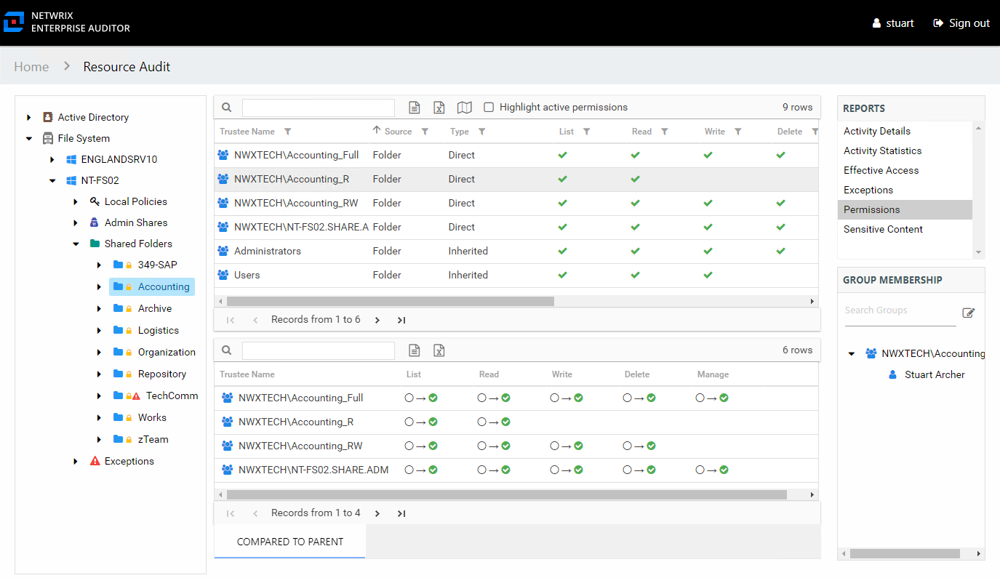
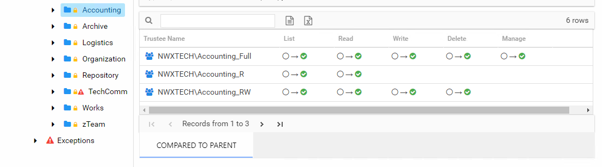
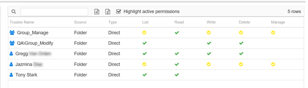
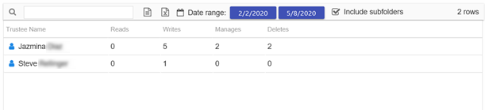
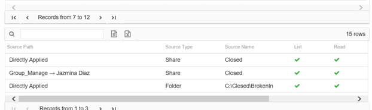

# Permissions Report

The Permissions report at the share and subfolder levels provides a list of trustees with permissions for the selected resource. This report includes a table with trustee access levels Compared to Parent.

If activity is being monitored for the selected resource, then this report indicates where stale permissions exist. See the [Stale Permissions](#Stale "Stale Permissions") topic for additional information.

This report is comprised of the following columns:

* Trustee Type – Type of the trustee (for example, Domain User or Domain Group)
* Trustee Name – Owner of the trustee account
* Trustee Account – Active Directory account associated with the trustee
* Department – Department to which the trustee account belongs
* Title – Trustee’s title as read from Active Directory
* Mail – Trustee’s email account as read from Active Directory
* EmployeeId – Corporate ID for the employee as read from Active Directory
* Description – Description of the trustee object as read from Active Directory
* DistinguishedName – Distinguished name for the trustee account
* ObjectSid – Security ID of the object
* Disabled – True or False if trustee account is disabled
* Deleted – True or False if trustee account is deleted
* Stale – True or False if trustee account is stale (according to the length of inactive time used by the Access Analyzer data collection and analysis configuration to identify stale accounts)
* Source – Share or Folder source of the permission
* Type – Direct or Inherited type of permission

The following rights are a normalized representation of the Share and NTFS permissions granted to the trustee:

* List – Right to view list of files and subfolders
* Read – Right to view/read files and subfolders
* Write – Right to add or modify files and subfolders
* Delete – Right to delete files and subfolders
* Manage – Equivalent to full control over files and subfolders

The following columns display the combined direct and inherited rights:

* Allow Mask – Bitmask corresponding to Windows ACE permission bits for combined direct and inherited allow rights
* Deny Mask – Bitmask corresponding to Windows ACE permission bits for combined direct inherited deny rights

If the selected trustee in the top section of the report is a group, the Group Membership pane displays the group membership, including nested groups.

There is one table at the bottom displaying Compared to Parent permissions for the select trustee. It contains information on explicit permissions granted for the selected resource.

This table will be blank unless an Explicit Permissions icon is attached to the resource in the Resources pane. See the [Resources Pane](../../Navigate/Resource#_Resources_Pane "Resources Pane") topic for additional information. This table is comprised of the same columns as the primary report.

## Stale Permissions

The Permissions report also displays where stale permissions exists. Stale permissions provide a way to identify when permissions assigned to a resource are unused. Unused permissions can be removed, if desired.

A stale permission is defined as an access level not used to perform an activity on the resource within the value set for the **ActivityDays** parameter in the `web.config` file. By default this is set to 60 days. This feature requires the Access Analyzer File System Activity Auditing (FSAC) collection jobs to be executed on a regular basis.

Select the **Highlight active permissionss** checkbox to show permissions that are in use. When a user or effective member of a group that has permissions to a resource also has activity on the resource, a yellow icon is displayed for the permission type to indicate the access level used to perform the activity. Therefore, access level cells not highlighted when activity is being monitored represent permissions that are identified as stale.

In the Permissions report, the yellow icons show permissions that are active, and the green check marks show permissions that are stale. The example shows that Jazmina’s activity has used the List, Write, Delete, and Manage permissions but not the Read permission. It also shows there are at least three other trustees with stale permissions.

The Activity Statisticsreport indicates that the trustee Jazmina has performed write, manage, and delete events on the selected resource. See the [Activity Statistics Report](ActivityStatistics "Activity Statistics Report") topic for additional information.

The Effective Access report shows that Jazmina has access to the resource through the Group\_Manage group, and the access is directly applied. See the [Effective Access Report](EffectiveAccess "Effective Access Report") topic for additional information.