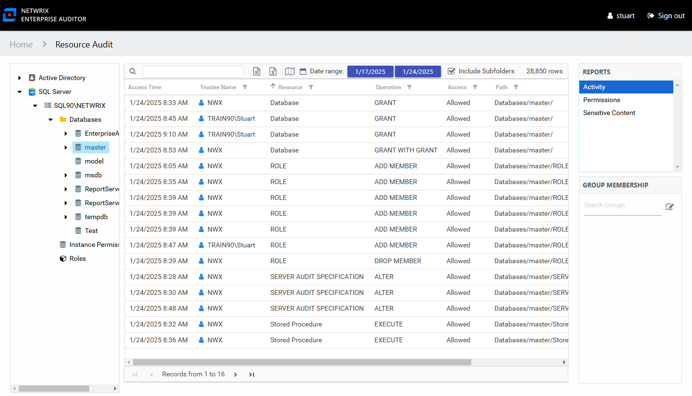

# Activity Report

The Activity report for imported data displays activity on the resource during the selected date range. The **Include Subfolders** option is active by default until removed. See the [Results Pane](../Navigate/Overview#Results "Results Pane") topic for information on changing this option.

This report is comprised of the following columns:

* Access Time – Date and timestamp for when the operation occurred
* Trustee Name – Owner of the trustee account
* Trustee Account – Account associated with the trustee
* Department – Department to which the trustee account belongs
* Title – Trustee’s title
* Mail – Trustee’s email account
* EmployeeId – Corporate ID for the employee
* Description – Description of the trustee object
* DistinguishedName – Distinguished name for the trustee account
* ObjectSid – Security ID of the object
* Disabled – True or False if trustee account is disabled
* Deleted – True or False if trustee account is deleted
* Resource – Type of resource
* Operation – Type of operation performed
* Access – Whether the trustee was granted access to execute the operation: **Allowed** or **Denied**
* Path – Database object that was acted upon
* Target Path – Query that triggered the activity event to be stored
* Process Name – Name of the process which performed the operation

The table data grid functions the same way as other table grids. See the [Data Grid Features](../../../General/DataGrid "Data Grid Features") topic for additional information.