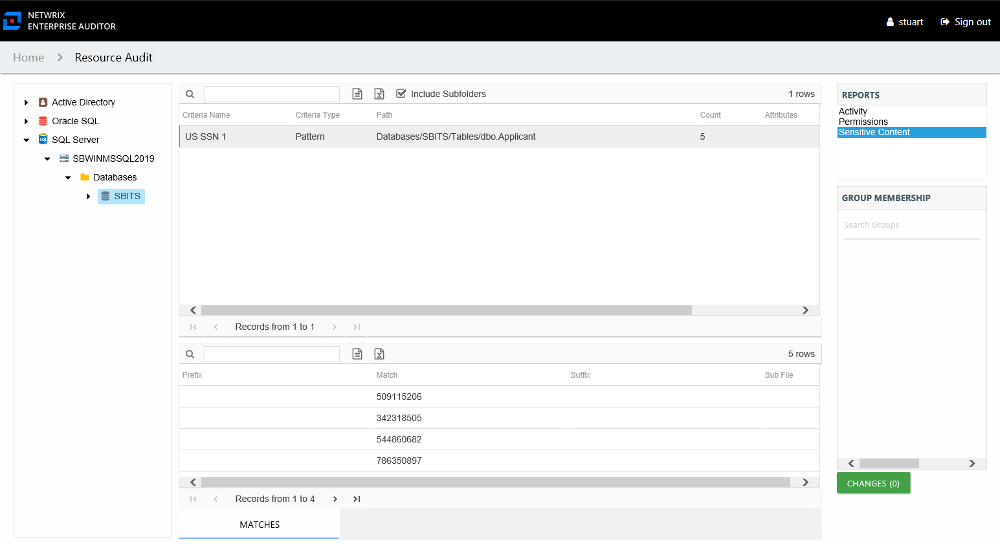

# Sensitive Content Report

The Sensitive Content report for imported data provides a list of paths and a hit count per table where criteria matches were found on the selected resource. This report includes a table visible to Access Information Center users with either Security Team Member or Administrator roles with criteria Matches. The Matches table requires the storage of discovered sensitive data within the Access Analyzer database or it will be blank. The **Include Subfolders** option is active by default until removed. See the [Results Pane](../Navigate/Overview#Results "Results Pane") topic for information on changing this option.

This report is comprised of the following columns:

* Criteria Name – Type of potentially sensitive criteria matches found
* Criteria Type – Pattern for pattern based matches (System Criteria), and subject type based on Subject Profile matches (for example, Customer, Employee, and so on)
* Path – Location of the file where the criteria matches were found
* Sub File – File name if the sensitive data files reside in a PST file or a ZIP file
* Count – Number of criteria matches found within each file
* Attributes – Comma separated list of Attributes found for the identity

There is one table at the bottom displaying Matches on the files where the selected criterion value were found:

* Prefix – Text just prior to the sensitive data match in the file
* Match – Lists any sensitive data matches found for the highlighted criteria in the top grid of the report
* Suffix – Text just after the sensitive data match in the file
* Sub File – File name if the sensitive data files reside in a PST file or a ZIP file

The table data grid functions the same way as other table grids. See the [Data Grid Features](../../../General/DataGrid "Data Grid Features") topic for additional information.