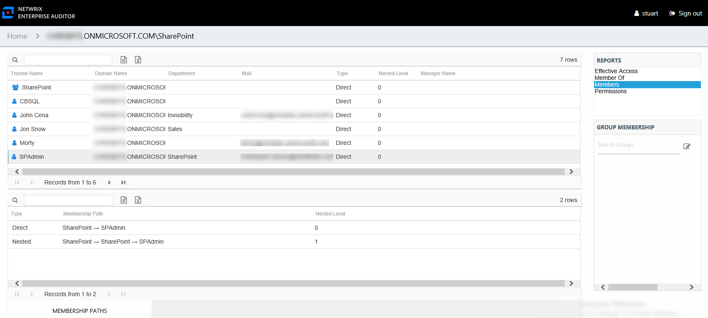
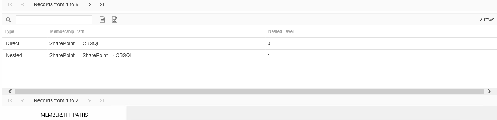

# Members Report for Entra ID Group

The Members report for a group object provides a list of all trustees, users, and groups with membership in the audited Entra ID (formerly Azure Active Directory) group. This report includes a Membership Paths table.

This report is comprised of the following columns:

* Trustee Name – Owner of the trustee account
* Domain Name – Name of the domain
* Department – Department to which the trustee account belongs
* Mail – Trustee’s email account as read from Active Directory
* Type – Type of membership the selected trustee has to the audited group

  * Direct – Trustee is specifically assigned to this group
  * Nested – Trustee is a member of a group which has membership in this group
* Nested Level – Count of groups nested between the audited group and the selected trustee’s direct membership
* Manager Name – Name of manager for the trustee from Entra ID

If the selected trustee is a group, the Group Membership pane displays the group membership, including nested groups.

There is one table at the bottom displaying Membership Paths for the selected Entra ID group. It contains all of the ways the audited group has been granted membership to the selected group.

* Type – Type of membership the selected trustee has to the audited group

  * Direct – Trustee is specifically assigned to this group
  * Nested – Trustee is a member of a group which has membership in this group
* Membership Path – Displays location for the selected trustee’s membership to the audited group, starts with audited group and ends with trustee

  * For Direct Membership – Path is [Group Name] > [Trustee Name]
  * For Nested Membership – Path is [Group Name] > [Name of Nested Group] > [Trustee Name]
* Nested Level – Count of groups nested between the audited group and the selected trustee’s direct membership