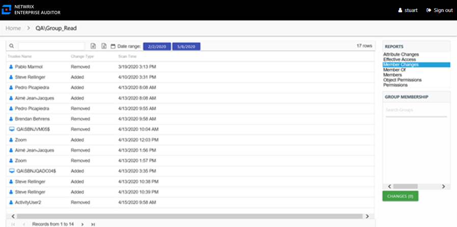

# Member Changes Report

The Member Changes report for a group object provides specific details for any membership changes to the audited group during the selected date range.

This report is comprised of the following columns:

* Trustee Name – Owner of the trustee account
* Trustee Account – Active Directory account associated with the trustee
* Department – Department to which the trustee account belongs
* Title – Trustee’s title as read from Active Directory
* Mail – Trustee’s email account as read from Active Directory
* EmployeeId – Corporate ID for the employee as read from Active Directory
* Description – Description of the trustee object as read from Active Directory
* DistinguishedName – Distinguished name for the trustee account
* ObjectSid – Security ID of the object
* Disabled – True or False if trustee account is disabled
* Deleted – True or False if trustee account is deleted
* Change Type – Type of change that occurred: Added to group or Removed from group
* Scan Time – Date and timestamp of the Access Analyzer scan that identified the change

If the selected trustee is a group, the Group Membership pane displays the group membership, including nested groups.