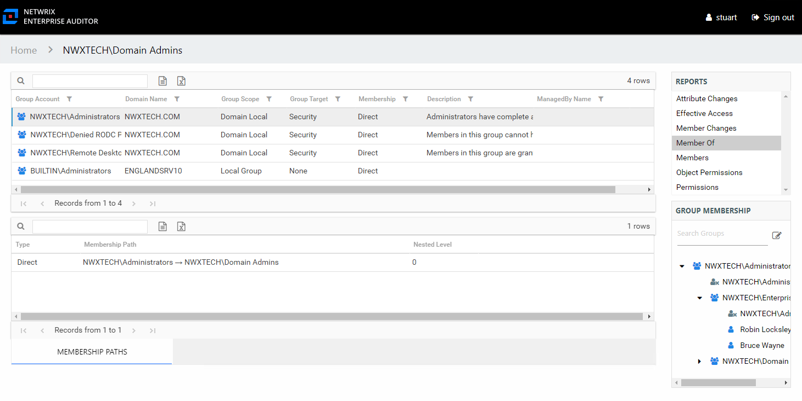

# Member Of Report

The Member Of report for a group object provides a list of all groups of which the audited group is a member. This report includes a Membership Paths table.

This report is comprised of the following columns:

* Group Account – Account associated with the group
* Group Mail – Group’s email account as read from Active Directory, if applicable
* Group ObjectSid – Security ID of the group object
* Domain Name – Name of the domain
* Group Scope – Scope of the group object: Domain Local, Global, or Universal
* Group Target – Type of the group object: Distribution or Security
* Membership – Type of membership the audited object has to the selected group

  * Direct – Object is specifically assigned to this group
  * Nested – Object is a member of a group which has membership in this group
* Description – Description of this group from Active Directory
* DistinguishedName – Distinguished name for the trustee account
* Created – Date Active Directory object was created
* Changed – Date and timestamp from last change as tracked by Active Directory (whenChanged attribute)
* ManagedBy Name – Name of manager for the group from Active Directory
* ManagedBy Logon – Trustee account for the group’s manager
* ManagedBy Department – Department of the group’s manager
* ManagedBy Mail – Email address for the group’s manager

Since this report is a list of groups, the Group Membership pane displays the group membership, including nested groups.

There is one table at the bottom displaying Membership Paths for the select group. It contains all of the ways the audited group has been granted membership to the selected group.

* Type – Type of membership the audited object has to the selected group

  * Direct – Object is specifically assigned to this group
  * Nested – Object is a member of a group which has membership in this group
* Membership Path – Displays location for the audited object’s membership to the selected group, starts with this group and ends with the selected group

  * For Direct Membership – Path is [Group Name] > [Selected Group Name]
  * For Nested Membership – Path is [Group Name] > [Name of Nested Group] > [Selected Group Name]
* Nested Level – Count of groups nested between the selected group and the audited object’s direct membership