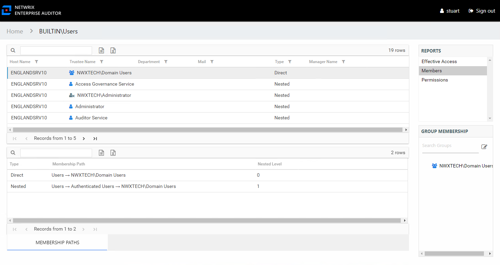

# Members Report for a Built-in Group

The Members report for a built-in group provides a list of all trustees, users, and groups with membership in the audited group. This report includes a Membership Paths table.

*Remember,* the Members report for a built-in group contains different information than the other group types.

This report is comprised of the following columns:

* Host Name – Name of the server (local groups) or domain where the audited group resides
* Group Type – Type of group being audited: local or domain
* Trustee Name – Owner of the trustee account
* Trustee Account – Active Directory account associated with the trustee
* Department – Department to which the trustee account belongs
* Title – Trustee’s title as read from Active Directory
* Mail – Trustee’s email account as read from Active Directory
* EmployeeId – Corporate ID for the employee as read from Active Directory
* Description – Description of the trustee object as read from Active Directory
* DistinguishedName – Distinguished name for the trustee account
* ObjectSid – Security ID of the object
* Disabled – True or False if trustee account is disabled
* Type – Type of membership the selected trustee has to the audited group

  * Direct – Trustee is specifically assigned to this group
  * Nested – Trustee is a member of a group which has membership in this group

If the selected trustee is a group, the Group Membership pane displays the group membership, including nested groups.

There is one table at the bottom displaying Membership Paths for the select group. It contains all of the ways the audited group has been granted membership to the selected group.

* Type – Type of membership the selected trustee has to the audited group

  * Direct – Trustee is specifically assigned to this group
  * Nested – Trustee is a member of a group which has membership in this group
* Membership Path – Displays location for the selected trustee’s membership to the audited group, starts with audited group and ends with trustee

  * For Direct Membership – Path is [Group Name] > [Trustee Name]
  * For Nested Membership – Path is [Group Name] > [Name of Nested Group] > [Trustee Name]
* Nested Level – Count of groups nested between the audited group and the selected trustee’s direct membership