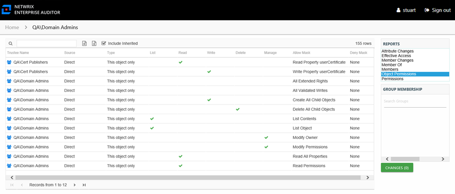

# Object Permissions Report

The Object Permissions report for a group object provides details on Active Directory permissions to the object.

The data within this report is collected by the Access Analyzer Active Directory Permissions Analyzer solution. See the Active Directory Permissions Analyzer Solution topic of the [Netwrix Access Analyzer Documentation](https://helpcenter.netwrix.com/category/accessanalyzer "Netwrix Access Analyzer Documentation") for additional information.

This report is comprised of the following columns:

* Trustee Type – Type of the trustee
* Trustee Name – Trustee with permissions to the object
* Trustee Account – Active Directory account associated with the trustee
* Department – Department to which the trustee account belongs
* Title – Trustee’s title as read from Active Directory
* Mail – Trustee’s email account as read from Active Directory
* EmployeeId – Corporate ID for the employee as read from Active Directory
* Description – Description of the trustee object as read from Active Directory
* DistinguishedName – Distinguished name for the trustee account
* ObjectSid – Security ID of the object
* Disabled – True or False if trustee account is disabled
* Deleted – True or False if trustee account is deleted
* Stale – True or False if trustee account is stale (according to the length of inactive time used by the Access Analyzer data collection and analysis configuration to identify stale accounts)
* Source – Direct or Inherited permission type
* Type – Type of resource where the permission is set

The following rights are a normalized representation of the permissions granted to the trustee:

* List – Right to view list of objects
* Read – Right to view/read objects
* Write – Right to add or modify objects
* Delete – Right to delete objects
* Manage – Equivalent to full control over objects

The following columns display the combined direct and inherited rights:

* Allow Mask – Bitmask corresponding to Windows ACE permission bits for combined direct and inherited allow rights
* Deny Mask – Bitmask corresponding to Windows ACE permission bits for combined direct inherited deny rights