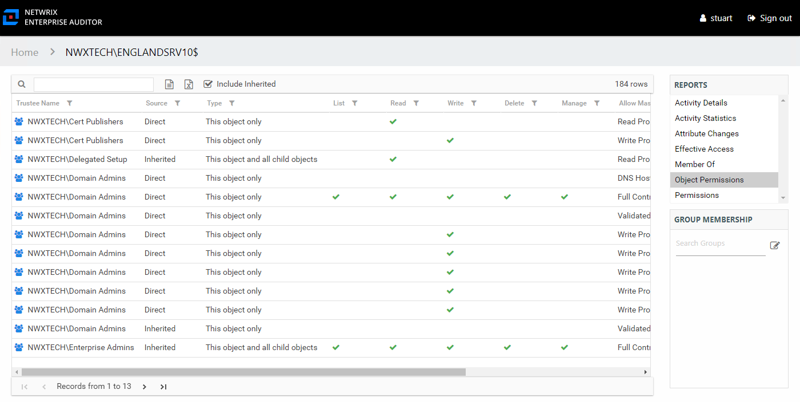

# Computer Audit Interface

The Computer Audit interface is opened by searching for a particular computer. See the [Search Features](Search "Search Features") topic for additional information. It contains three panes in all audit interfaces: Reports, Results, and Group Membership.

The computer being audited is identified at the top of the interface as part of the interface breadcrumb. See the [Computer Reports](../Computer/Overview "Computer Reports") topic for additional information.