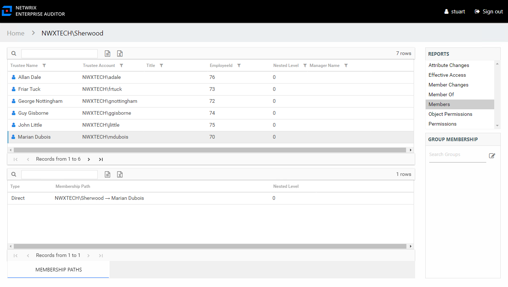

# Group Audit Interface

The Group Audit interface is opened by searching for a particular Active Directory or Entra ID group. See the [Search Features](Search "Search Features") topic for additional information. It contains three panes in all audit interfaces: Reports, Results, and Group Membership.

The group being audited is identified at the top of the interface as part of the interface breadcrumb. See the [Group Reports](../Group/Overview "Group Reports") topic for additional information.