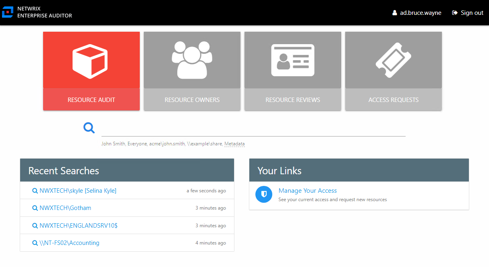
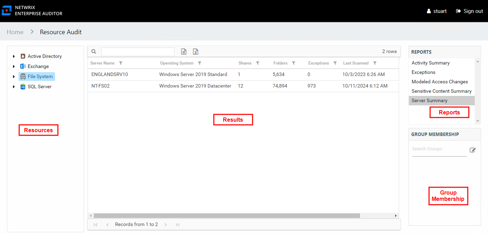
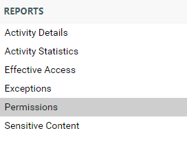
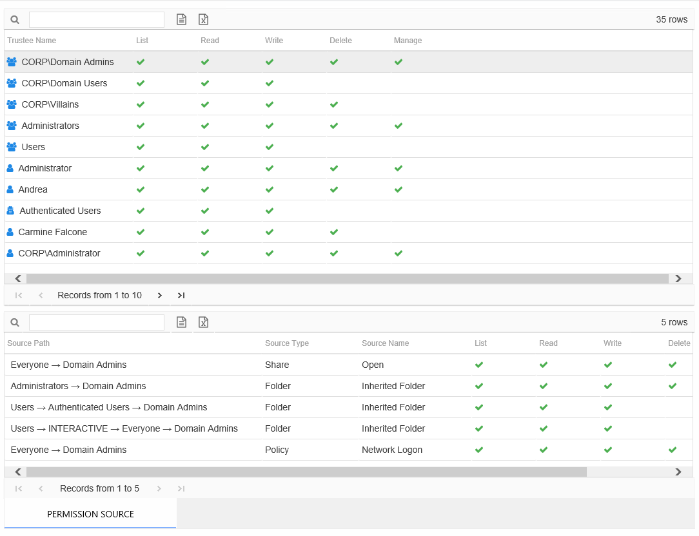
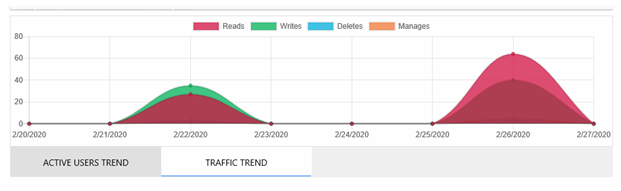
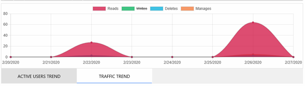
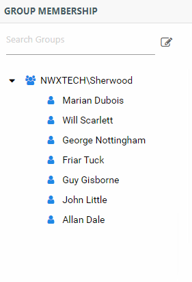
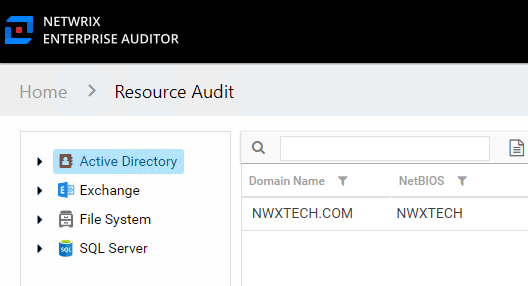

# Audit Interfaces

The audit interfaces are accessible from the home page of the Access Information Center.

The **Resource Audit** button opens the Resource Audit interface. The search features, which include a search bar and a Recent Searches box, can be used to open any audit interface.

## Interface Components

All audit interfaces consist of at least three components, and the Resource Audit interface includes a fourth pane.

The main section of the audit interface is the Results pane. On the right-side of the page are the Reports and Group Membership panes. On the Resource Audit interface, the Resources pane is to the left of the Results pane. Theses panes have the following functions:

* [Reports Pane](#Reports "Reports Pane") – Lists available reports for the resource type
* [Results Pane](#Results "Results Pane") – Displays the report content
* [Group Membership Pane](#Group "Group Membership Pane") – Displays group membership for group trustees selected in the Results pane
* [Resources Pane](Resource#_Resources_Pane "Resources Pane") – Navigation tree for the selected resource (only present in the Resource Audit interface)

### Reports Pane

The Reports pane lists available reports based on the type of resource selected.

The report for the selected resource displays in the Results pane.

### Results Pane

The Results pane displays report data based on the selections in both the Resources pane and the Reports pane. Reports may consist of multiple tables and graphs.

Tables and graphs that display at the bottom of the pane vary according to the selected report. See the [Data Grid Features](../../../General/DataGrid "Data Grid Features") topic for additional information on table options. See the individual report topics for specific information on columns and displayed data for a report.

#### Additional Report Options

There are two checkbox options depending on the report selected:

* Include Subfolders – Select to include subfolders of the selected share or folder in the report
* Highlight Active Permissions – Select to show permissions that are in use. When a user or effective member of a group that has permissions to a resource also has activity on the resource, a yellow icon is displayed for the permission type to indicate the access level used to perform the activity. Therefore, access level cells not highlighted when activity is being monitored represent permissions that are identified as stale. See the [Stale Permissions](../FileSystem/ShareSubfolder/Permissions#Stale "Stale Permissions") topic for additional information.

#### Activity Report Results Pane Features

Activity reports contain the following unique features.

Date Range Filter

Activity reports display information for a selected date range. To adjust the date range, click the **Date Range** filter to open a calendar window. The date range can be changed manually by selecting dates in the calendars, using the arrows to change the month. Once the selection is made, click **OK**. The report loads data for the new date range.

Trend Graphs

Trend graphs are line graphs that provide a visual representation of the activity that occurred over the selected date range.

The vertical axis (X-axis) is the activity count value for the graph (unit is the number of events). The horizontal axis (Y-axis) is the time line for the graph. The legend identifies what the colors represent. Hover over any point on the graph for the details to appear. Trend graphs can be filtered to only display specific objects from the legend. Deselect an object in the legend to remove that object from the graph, only showing the remaining objects.

For example, if the **Writes** operation is deselected, only the operations of **Reads**, **Deletes**, and **Manages** remain on the line graph.

### Group Membership Pane

The Group Membership pane list members for an Active Directory or Entra ID group selected in the Results pane. Groups can also be searched for using the textbox at the top of the pane.

All group members are listed, including any nested group membership. The **Change Group Membership** button displays any access changes being modeled. This is a primary component of change modeling. See the [Change Modeling](../ChangeModeling/Overview "Change Modeling") topic for additional information.

**NOTE:** If the Access Information Center has been configured to commit changes to Active Directory, then there is a **Commit** button within the **Changes** window. Click **Commit** to commit the modeled changes to Active Directory. Only Access Information Center Administrators can configure the Access Information Center to commit changes to Active Directory.

While a resource owner has access to a Resource Audit interface filtered for their resource and can model changes, only users with an Administrator or a Security Team role are able to commit modeled access changes. However, if the ad hoc changes have been enabled on a resource, the owner can use the **Change Access** button in the Owner portal to commit changes.

### Interface Breadcrumb

In the upper-left corner of every interface, with the exception of the home page, is the Access Information Center Console navigation path, or breadcrumb.

In this example, the path is **Home > Resource Audit**. If a link from a resource report is used to view a particular user audit, it would read **Home > Resource Audit > User Audit**. Clicking any part of the path takes you to that interface.