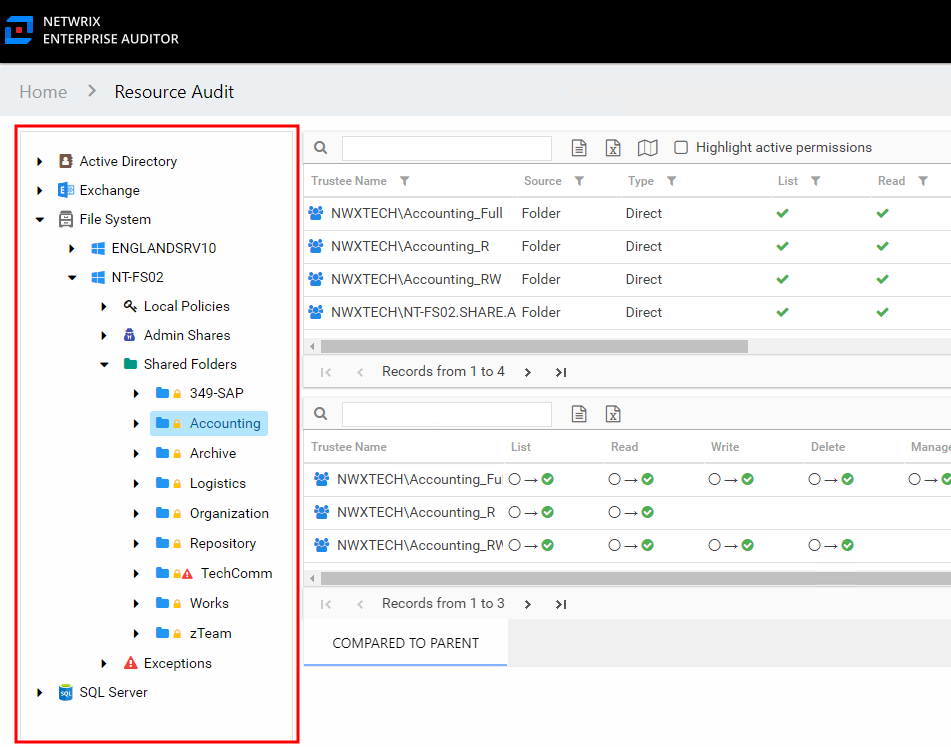

# Resource Audit Interface

The Resource Audit interface is where resource reports are located. Summary and detail reports are available for permissions, effective access, activity, and sensitive data. Open the Resource Audit interface by clicking **Resource Audit** on the home page of the Access Information Center or using the search features to open a filtered view for a resource.

Available reports vary based on the type of resource and the level within the resource. See the following topics for specific report details:

* [File System Reports](../FileSystem/Overview "File System Reports")
* [SharePoint Reports](../SharePoint/Overview "SharePoint Reports")
* [Active Directory Reports](../ActiveDirectory/Overview "Active Directory Reports")
* [Amazon (AWS) Reports](../AWS/Overview) Reports")
* [Dropbox Reports](../Dropbox/Overview "Dropbox Reports")
* [Exchange Reports](../Exchange/Overview "Exchange Reports")
* [MongoDB Reports](../MongoDB/Overview "MongoDB Reports")
* [MySQL Reports](../MySQL/Overview "MySQL Reports")
* [Oracle Reports](../Oracle/Overview "Oracle Reports")
* [PostgreSQL Reports](../PostgreSQL/Overview "PostgreSQL Reports")
* [SQL Server Reports](../SQL/Overview "SQL Server Reports")
* [Flexible Imports Feature](../FlexibleImports/Overview "Flexible Imports Feature")

## Resources Pane

The Resources pane, which is unique to the Resource Audit interface, displays a navigation view of available resources. Only those resource environments that have been scanned by Access Analyzer or introduced to the Access Information Center with Flexible Imports are available. Explore the desired resource by expanding the levels.

Select a resource in the Resources pane and a report in the Reports pane to to view the report data in the Results pane. Hover over any icon in the Access Information Center interface to view its description.

The Explicit Permissions, Exception, and Alert icons can shown next a resource icon in the Resources pane.

* Explicit Permissions – Indicates permissions for the resource are different than the permission of its parent. This is caused by broken inheritance or adding new permissions to a resource.
* Exception – Indicates the existence of a risk to data governance security on the resource as identified by Access Analyzer. Exceptions include permissions granted to stale, disabled, or high-risk trustees (for example, Everyone, Authenticated Users, and Domain Users). The following Access Analyzer jobs identify the Access Information Center exceptions:

  * **.Active Directory Inventory** > **3-AD\_Exceptions**
  * **.Entra ID Inventory** > **2-AAD\_Exceptions**
  * **FileSystem** > **0.Collection** > **3-FSAA Exceptions**
  * **SharePoint** > **0.Collection** > **7-SPAA\_Exceptions**
* Alert – Indicates the existence of an activity exception that has been identified by Access Analyzer as a security risk on that resource. Alerts include periods of unusually high volumes of activity events and users accessing shares for the first time. The following Access Analyzer job identifies the Access Information Center alerts:

  * **FileSystem** > **0.Collection** > **3-FSAC Exceptions**

These icons are designed to draw attention to resources where potential security concerns may exist.

**NOTE:** The Domain Group icon is used to indicate both Active Directory groups and Entra ID groups. See the [AIC Icons](Icons "AIC Icons") topic for additional information.