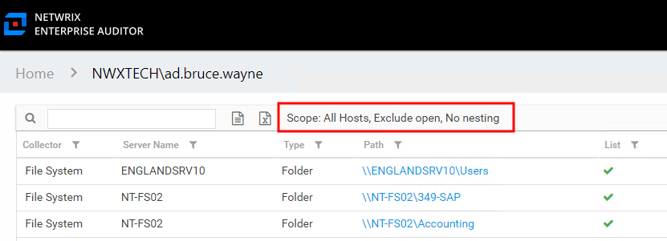
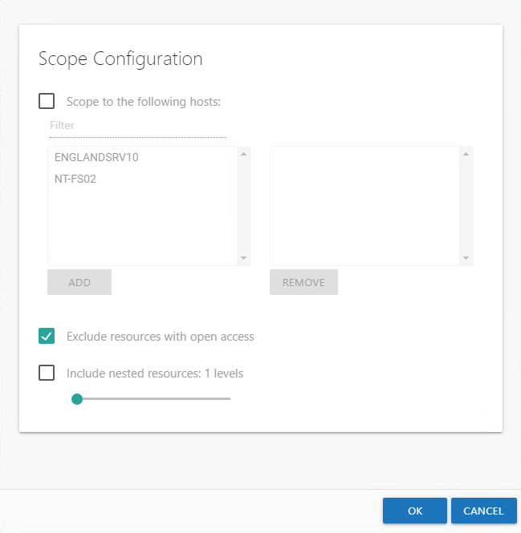

# Scope an Effective Access Report

Once an Effective Access report’s loading process has stopped, either by completing the analysis of the targeted environments or via the **Cancel** button, follow the steps to change the scoping settings.

**Step 1 –** Click **Scope** at the top of the report in the Results pane. The Scope Configuration window opens.

**Step 2 –** There are three scoping options that can be applied individually or in any combination:

* Scope report to the following hosts – Limits the report to selected hosts

  * Select the checkbox to apply this scoping option
  * Select a host from the list in the left box. It is possible to select multiple hosts with basic Windows commands (Ctrl-left-click).
  * Click **Add**
  * Use **Remove** to edit the selection box on the right
* Exclude resources with open access – Limits the report to exclude access granted through high-risk trustee (for example, Everyone, Authenticated Users, and Domain Users)

  * Select the checkbox to exclude these high-risk trustees from the effective access calculations
* Include nested resources – Broadens the report to include nested resources according to the depth level set

  * Select the checkbox to include nested resources
  * Move the slider to select the desired nested depth level

**Step 3 –** When the scoping options have been set as desired, click **OK**.

The Effective Access report begins the loading process based on the new scoping parameters.