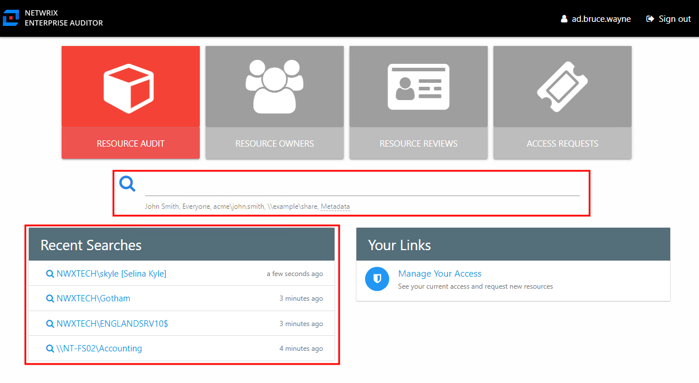
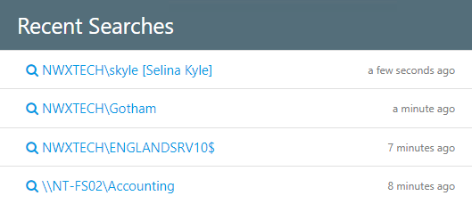

# Search Features

The Search features consist of the search bar and the Recent Searches box on the home page.

Selecting a search object from either the search bar or the Recent Searches box opens the associated audit interface.

## Search Bar

Typing in the search bar generates a list of possible search objects based on the data available in the Access Analyzer database. To search for sensitive data criteria, the search string must start with `SDD` followed by a space.

## Recent Searches Box

The **Recent Searches** box displays all recent searches conducted by the current Access Information Center user.

The last searched object is always at the top of the list. A timestamp indicates when the search was conducted. The historical searches included within this box were conducted by the logged in Access Information Center user.