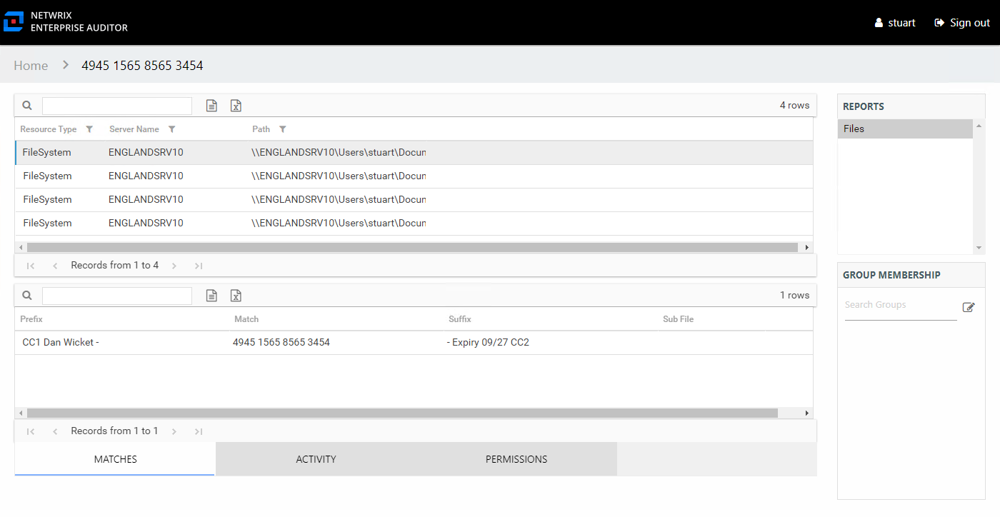

# Sensitive Content Audit Interface

The Sensitive Content Audit interface is opened by searching for a particular criteria value. See the [Search Features](Search "Search Features") topic for additional information. It contains three panes in all audit interfaces: Reports, Results, and Group Membership.

In order to enable the criteria match search feature, the **Store discovered sensitive data** option must be enabled in the Access Analyzer data collector scanning the target environment. See the relevant solution topic in the [Netwrix Access Analyzer Documentation](https://helpcenter.netwrix.com/category/accessanalyzer "Netwrix Access Analyzer Documentation") for additional information on the data collection options.

The criterion being audited is identified at the top of the interface as part of the interface breadcrumb. See the [Sensitive Content Reports](../SensitiveContent/Overview "Sensitive Content Reports") topic for additional information.