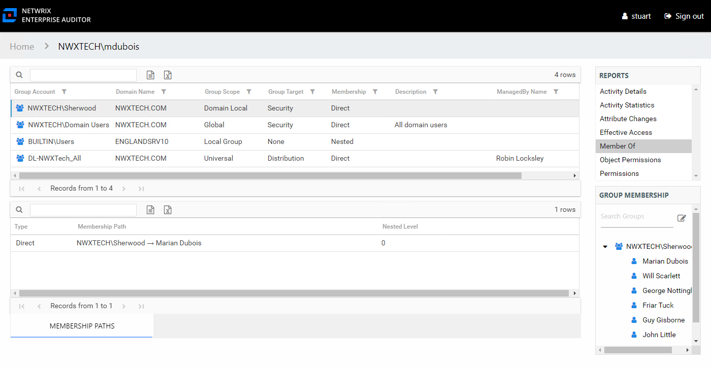

# User Audit Interface

The User Audit interface is opened by searching for a particular Active Directory or Entra ID user. See the [Search Features](Search "Search Features") topic for additional information. It contains three panes in all audit interfaces: Reports, Results, and Group Membership.

The user being audited is identified at the top of the interface as part of the interface breadcrumb. See the [User Reports](../User/Overview "User Reports") topic for additional information.