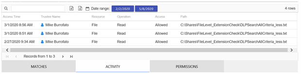
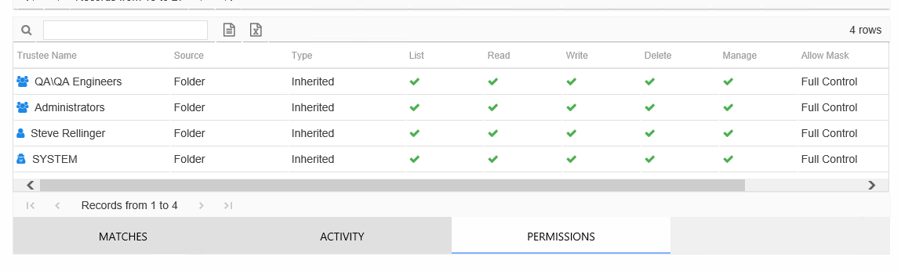

# Files Report

The Files report for sensitive content provides a list of all files for the targeted environments which have matches to the searched Sensitive Data Discovery criteria. This report includes additional tables:

* Matches – Displays information on the criteria hits found on the selected file
* Activity – Displays information on activity performed on the selected file during the selected date range
* Permissions – Displays information on the trustees with effective access to the parent object or folder that contains the selected sensitive data file

This report is comprised of the following columns:

* Resource Type – Target environment where the sensitive file exists. For example, File System or SharePoint.
* Server Name – Name of the file system server or SharePoint farm/instance
* Path – Location of the file

There are three tables at the bottom displaying Matches, Activity, and Permissions for the selected resource.

## Matches Table

The Matches table displays information on the criteria hits found on the selected file. This table is comprised of the following columns:

* Prefix – Text just prior to the sensitive data match in the file
* Match – Lists any sensitive data matches found for the highlighted criteria in the top grid of the report
* Suffix – Text just after the sensitive data match in the file
* Sub File – File name if the sensitive data files reside in a PST file or a ZIP file

## Activity Table

The Activity table displays information on activity performed on the selected file during the selected date. It will be blank if any of the following are true:

* Activity is not being monitored for the targeted environment
* The activity collection job within Access Analyzer for the environment have not been run
* There were no operation events logged on the selected file for the selected date range

This table is comprised of the following columns:

* Access Time – Date and timestamp for when the operation occurred
* Trustee Name – Name of the trustee who performed the event on the file
* Trustee Account – Active Directory account associated with the trustee
* Department – Department to which the trustee account belongs as read from Active Directory
* Title – Trustee’s title as read from Active Directory
* Mail – Trustee’s email account as read from Active Directory
* EmployeeId – Corporate ID for the employee as read from Active Directory
* Description – Description of the trustee object as read from Active Directory
* DistinguishedName – Distinguished name for the trustee account
* ObjectSid – Security ID of the object
* Disabled – True or False if trustee account is disabled
* Deleted – True or False if trustee account is deleted
* Resource – Resource type being accessed. For sensitive data discovery, this will always be File.
* Operation – Type of operation performed on the file (read, add, update, delete, permission change, rename)
* Access – Whether the trustee was granted access to execute the operation: **Allowed** or **Denied**
* Path – Location of the file
* Target Path – New location if changed by the operation. Blank if the operation does not result in a new path.
* Process Name – Name of the process which performed the operation

## Permissions Table

The Permissions table displays information on the trustees with effective access to the parent object or folder housing the selected sensitive data file.

This table is comprised of the following columns:

* Trustee Type – Type of the trustee (for example, Domain User or Domain Group)
* Trustee Name – Name of the trustee who has effective access to the file
* Trustee Account – Active Directory account associated with the trustee
* Department – Department to which the trustee account belongss as read from Active Directory
* Title – Trustee’s title as read from Active Directory
* Mail – Trustee’s email account as read from Active Directory
* EmployeeId – Corporate ID for the employee as read from Active Directory
* Description – Description of the trustee object as read from Active Directory
* DistinguishedName – Distinguished name for the trustee account
* ObjectSid – Security ID of the object
* Disabled – True or False if trustee account is disabled
* Deleted – True or False if trustee account is deleted
* Stale – True or False if trustee account is stale (according to the length of inactive time used by the Access Analyzer data collection and analysis configuration to identify stale accounts)
* Source – Share or Folder source of the permission
* Type – Direct or Inherited type of permission

The following rights are a normalized representation of the permissions granted to the trustee:

* List – Right to view list of files and subfolders
* Read – Right to view/read files and subfolders
* Write – Right to add or modify files and subfolders
* Delete – Right to delete files and subfolders
* Manage – Equivalent to full control over files and subfolders

The following columns display the combined direct and inherited rights:

* Allow Mask – Bitmask corresponding to Windows ACE permission bits for combined direct and inherited allow rights
* Deny Mask – Bitmask corresponding to Windows ACE permission bits for combined direct inherited deny rights