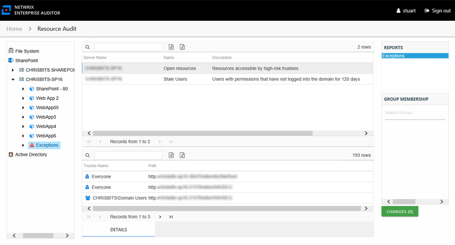

# Exceptions Report

The Exceptions report at the **Exceptions** node provides a list of exceptions found on the farm/instance. This report includes a Details table.

An exception is defined as a problem or risk to data governance security. Exceptions include open access and permissions granted to stale or disabled users. This report is comprised of the following columns:

* Server Name – Single server name representing the entire SharePoint on-premise farm or SharePoint Online instance
* Name – Type of exception found
* Description – Description of the exception type
* Count – Number of this type of exception found on the farm/instance

There is one table at the bottom displaying Details for the selected exception:

* Trustee Name – Owner of the trustee account
* Path – Location of the resource where the exception exists