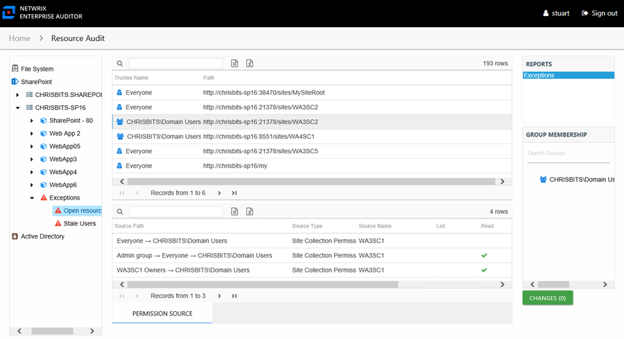
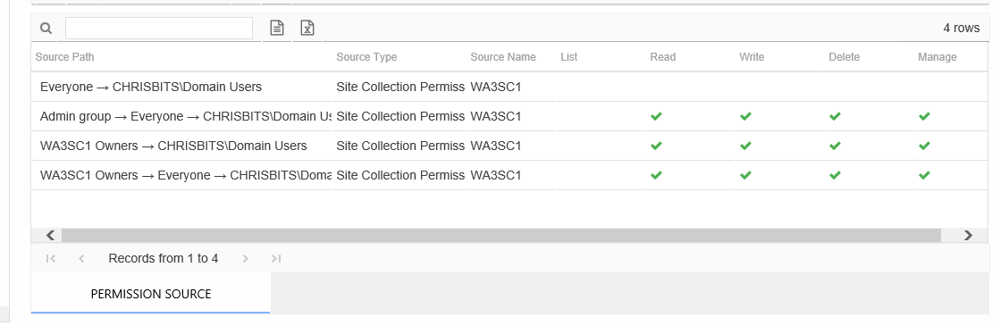

# Exceptions by Type Report

The Exceptions report at the exception type level provides details on the selected exception type. An exception is defined as a problem or risk to data governance security. This report includes a Permission Source table.

This report is comprised of the following columns:

* Trustee Name – Owner of the trustee account
* Path – Location of the resource where the exception exists

If the selected trustee in the top section of the report is a group, the Group Membership pane displays the group membership, including nested groups.

There is one table at the bottom displaying Permission Source for the select trustee. It contains all of the ways the selected trustee has been granted rights to the selected resource.

The number of rows for this table indicates the number of ways this trustee has been granted access. This table is comprised of the following columns:

* Source Path – Location for which the trustee was granted rights to the selected resource, which can be represented two ways:

  * Directly Applied – Rights granted directly to the selected trustee
  * Access through another trustee, path starts with trustee assigned the direct rights and shows all nested groups leading to the selected trustee
* Source Type – Source of the permission (for example, Site Permission, Web Application Policy, Site Collection Administrator, and so on)
* Source Name – Name of the site collection, site, library, list, or folder where the permission is assigned

The following rights are a normalized representation of the SharePoint permission levels (SharePoint Roles) granted to the trustee:

* List – Right to view list of SharePoint resources
* Read – Right to view/read SharePoint resources
* Write – Right to add or modify SharePoint resources
* Delete – Right to delete SharePoint resources
* Manage – Equivalent to full control over SharePoint resources

The following columns display the combined direct and inherited rights:

* Allow Mask – Bitmask corresponding to Windows ACE permission bits for combined direct and inherited allow rights
* Deny Mask – Bitmask corresponding to Windows ACE permission bits for combined direct inherited deny rights