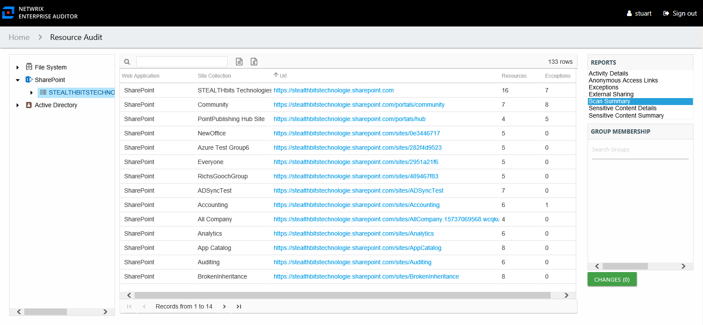

# Scan Summary Report

The Scan Summary report at the on-premise farm and online instance levels provides a summary view of all site collections on the selected farm/instance.

This report is comprised of the following columns:

* Web Application

  * On-premises farm – Name of the web application to which the site collection belongs
  * Online instance – Reflects the main nodes in the resource tree. The value is either **Personal**, **Public**, or **SharePoint**.
* Site Collection

  * On-premises farm – Display name of the site collection
  * Online instance – Display types of site collections

    * Personal – Resources found under the **OneDrive for Business** node
    * Public – Resources found under the **Public** node
    * SharePoint – Resources directly under the online instance level
* Url – URL path to the site collection
* Resources – Count of resources within the site collection
* Exceptions – Count of exceptions within the site collection