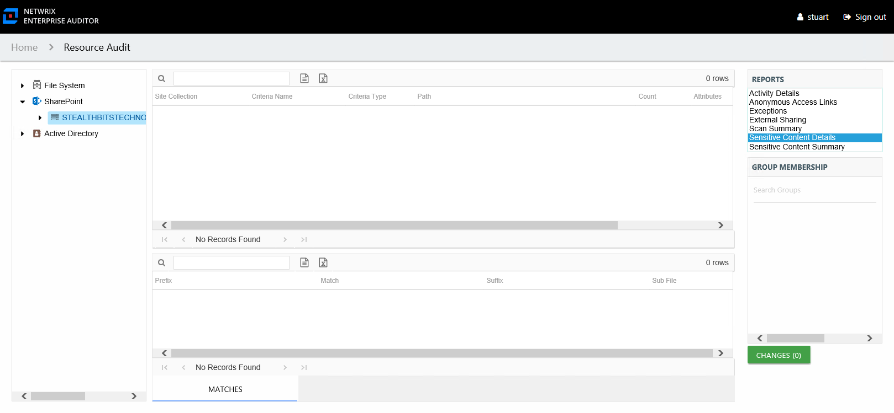

# Sensitive Content Details Report

The Sensitive Content Details report at the on-premise farm and online instance level provides details of files where criteria matches were found on the site collection. This report includes a Matches table.

This report is comprised of the following columns:

* Site Collection – Name of the site collection
* Criteria Name – Type of potentially sensitive criteria matches found
* Criteria Type – Pattern for pattern based matches (System Criteria), and subject type based on Subject Profile matches (for example, Customer, Employee, and so on)
* Path – Location of the file where the criteria matches were found
* Sub File – File name if the sensitive data files reside in a PST file or a ZIP file
* Count – Number of files with criteria matches
* Attributes – Comma separated list of Attributes found for the identity

There is one table at the bottom displaying Details on the files where the selected criterion value were found:

* Prefix – Text just prior to the sensitive data match in the file
* Match – Lists any sensitive data matches found for the highlighted criteria in the top grid of the report
* Suffix – Text just after the sensitive data match in the file
* Sub File – File name if the sensitive data files reside in a PST file or a ZIP file