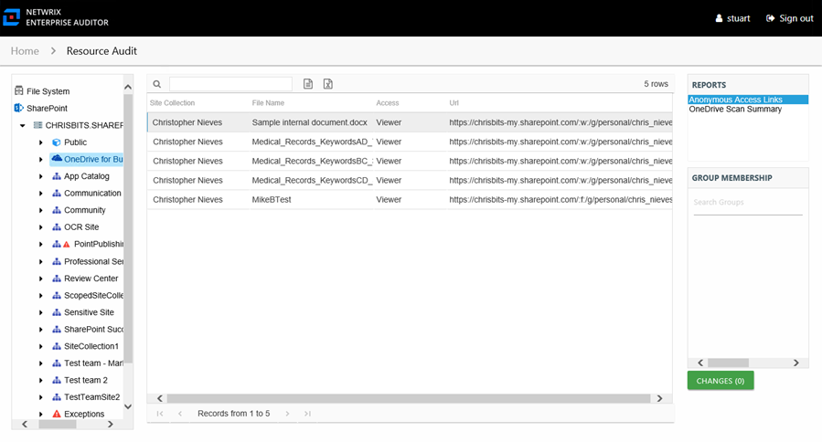

# Anonymous Access Links Report

The Anonymous Access Links report at the **OneDrive for Business** level displays personal sites that have access links generated to be shared with people outside of the organization (guest/anonymous users).

This report is comprised of the following columns:

* Site Collection – Site collection where the personal site resides
* File Name – Name of the file that is being shared anonymously
* Access – Type of access to the personal site granted to the guest/anonymous users
* URL – Path to the shared resource