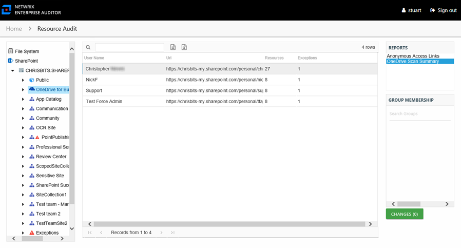

# OneDrive Scan Summary Report

The OneDrive Scan Summary report at the **OneDrive for Business** node provides an overview of scanned personal drives.

This report is comprised of the following columns:

* User Name – Name of the user with the OneDrive for Business personal site
* Url – Path to the OneDrive for Business personal site
* Resources – Count of resources that reside under each personal site
* Exceptions – Count of exceptions found in the personal site