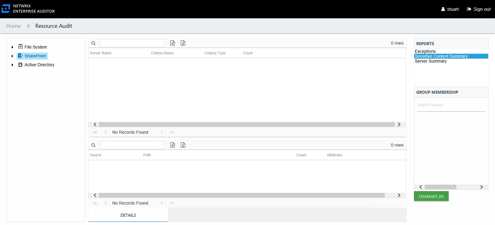

# Sensitive Content Summary Report

The Sensitive Content Summary report at the **SharePoint** node provides a count of files where criteria matches were found in the targeted SharePoint on-premise farms and SharePoint Online instances. This report includes a Details table.

This report is comprised of the following columns:

* Server Name – Single server name representing the entire SharePoint on-premise farm or SharePoint Online instance
* Criteria Name – Type of potentially sensitive criteria matches found
* Criteria Type – Pattern for pattern based matches (System Criteria), and subject type based on Subject Profile matches (for example, Customer, Employee, and so on)
* Count – Number of files with criteria matches

There is one table at the bottom displaying Details on the files where the selected criterion matches were found:

* Source — For System Criteria this shows the criteria name (for example, Credit Cards). For Subject Profiles criteria it shows the individual identities (for example, Jon Doe).
* Path – Location of the file where the criteria matches were found
* Sub File – File name if the sensitive data files reside in a PST file or a ZIP file
* Count – Number of criteria matches found within each file
* Attributes – Comma separated list of Attributes found for the identity