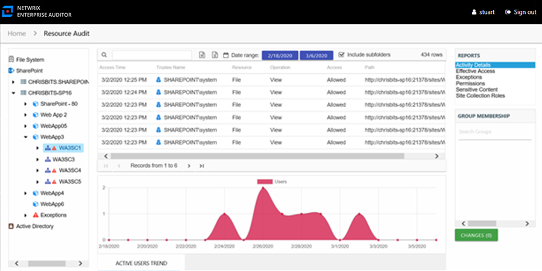
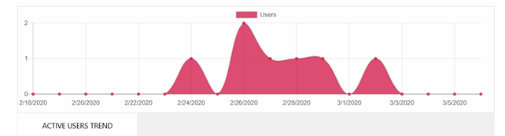

# Activity Details Report

The Activity Details report at the site collection, site, list, library, and folder levels provides statistical activity event information by user on the selected server during the specified date range. This report includes a line graph for Active Users Trend.

The **Include subfolders** option is active by default until removed. See the [Results Pane](../../Navigate/Overview#Results "Results Pane") topic for information on changing this option.

This report is comprised of the following columns:

* Access Time – Date and timestamp for when the operation occurred
* Trustee Name – Owner of the trustee account
* Trustee Account – Active Directory account associated with the trustee
* Department – Department to which the trustee account belongs
* Title – Trustee’s title as read from Active Directory
* Mail – Trustee’s email account as read from Active Directory
* EmployeeId – Corporate ID for the employee as read from Active Directory
* Description – Description of the trustee object as read from Active Directory
* DistinguishedName – Distinguished name for the trustee account
* ObjectSid – Security ID of the object
* Disabled – True or False if trustee account is disabled
* Deleted – True or False if trustee account is deleted
* Resource – Resource type being accessed
* Operation – Name of operation logged
* Access – Whether the trustee was granted access to execute the operation: **Allowed** or **Denied**
* Path – Original location where the operation occurred
* Target Path – New location if changed by the operation. Blank if the operation does not result in a new path.
* Process Name – Name of the process which performed the operation

The table data grid functions the same way as other table grids. See the [Data Grid Features](../../../../General/DataGrid "Data Grid Features") topic for additional information.

There is one line graph at the bottom displaying the Active Users Trend for the selected event.

The line graph provides a visual representation of the number of active users over the selected date range. It indicates how many users are performing activity per day.

See the [Activity Report Results Pane Features](../../Navigate/Overview#Activity "Activity Report Results Pane Features") topic for instructions on filtering the trend graph.