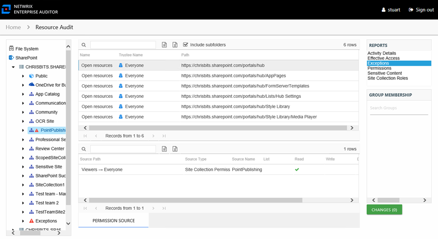
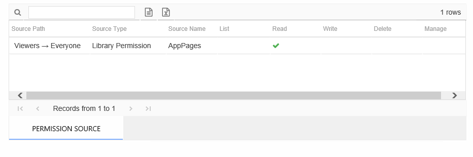

# Exceptions Report

The Exceptions report at the site collection, site, list, library, and folder levels provides a list of all trustees with access that are causing exceptions on the selected resource. This report includes a Permission Source table.

An exception is defined as a problem or risk to data governance security. Exceptions include open access and permissions granted to stale or disabled users. This table is blank unless an Exception icon is attached to the resource in the Resources pane, indicating exceptions were found. See the [Resources Pane](../../Navigate/Resource#_Resources_Pane "Resources Pane") topic for additional information.

This report is comprised of the following columns:

* Name – Type of exception found
* Trustee Name – Owner of the trustee account
* Path – Location of the resource where the exception exists

There is one table at the bottom displaying Permission Source for the select trustee. It contains all of the ways the selected trustee has been granted rights to the selected resource.

The number of rows for this table indicates the number of ways this trustee has been granted access. This table is comprised of the following columns:

* Source Path – Location for which the trustee was granted rights to the selected resource, which can be represented two ways:

  * Directly Applied – Rights granted directly to the selected trustee
  * Access through another trustee, path starts with trustee assigned the direct rights and shows all nested groups leading to the selected trustee
* Source Type – Source of the permission (for example, Site Permission, Web Application Policy, Site Collection Administrator, and so on)
* Source Name – Name of the resource where the permission is assigned

The following rights are a normalized representation of the SharePoint permission levels (SharePoint Roles) granted to the trustee:

* List – Right to view list of SharePoint resources
* Read – Right to view/read SharePoint resources
* Write – Right to add or modify SharePoint resources
* Delete – Right to delete SharePoint resources
* Manage – Equivalent to full control over SharePoint resources

The following columns display the combined direct and inherited rights:

* Allow Mask – Bitmask corresponding to Windows ACE permission bits for combined direct and inherited allow rights
* Deny Mask – Bitmask corresponding to Windows ACE permission bits for combined direct inherited deny rights