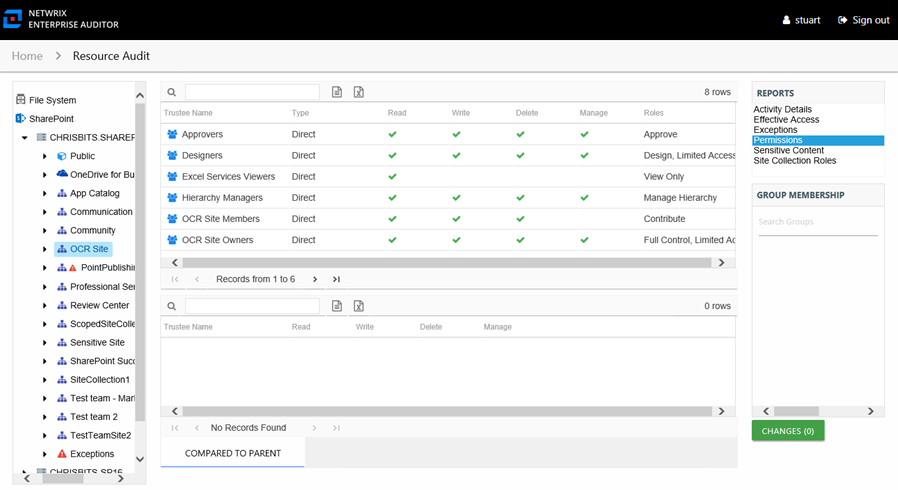
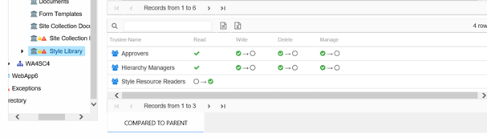

# Permissions Report

The Permissions report at the site collection, site, list, library, and folder levels provides a list of trustees with permissions for the selected resource. This report includes a table with trustee access levels Compared to Parent.

This report is comprised of the following columns:

* Trustee Name – Owner of the trustee account
* Trustee Account:

  * On-premises farm – Active Directory account associated with the trustee
  * Online instance – Entra ID account associated with the trustee
* Department – Department to which the trustee account belongs
* Title – Trustee’s title as read from Active Directory for on-premise farms or Entra ID for online instances
* Mail – Trustee’s email account as read from Active Directory for on-premise farms or Entra ID for online instances
* EmployeeId – Corporate ID for the employee as read from Active Directory for on-premise farms or Entra ID for online instances
* Description – Description of the trustee object as read from Active Directory for on-premise farms or Entra ID for online instances
* DistinguishedName – Distinguished name for the trustee account
* ObjectSid – Security ID of the object
* Disabled – True or False if trustee account is disabled
* Deleted – True or False if trustee account is deleted
* Stale – True or False if trustee account is stale (according to the length of inactive time used by the Access Analyzer data collection and analysis configuration to identify stale accounts)
* Type – Direct or Inherited type of permission
* Roles – Role name for the SharePoint permission level. For additional detail on what permissions each Role grants, see the Permission Mask column in the [Site Collection Roles Report](SiteCollectionRoles "Site Collection Roles Report").

The following rights are a normalized representation of the SharePoint permission levels (SharePoint Roles) granted to the trustee:

* Read – Right to view/read SharePoint resources
* Write – Right to add or modify SharePoint resources
* Delete – Right to delete SharePoint resources
* Manage – Equivalent to full control over SharePoint resources

If the selected trustee in the top section of the report is a group, the Group Membership pane displays the group membership, including nested groups.

There is one table at the bottom displaying Compared to Parent permissions for the select trustee. It contains information on explicit permissions granted for the selected resource.

This table is blank unless an **Explicit Permissions** icon is attached to the resource in the Resources pane. See the [Resources Pane](../../Navigate/Resource#_Resources_Pane "Resources Pane") topic for additional information. This table is comprised of the same columns as the primary report, with the exception that it does not have the **Roles** column.