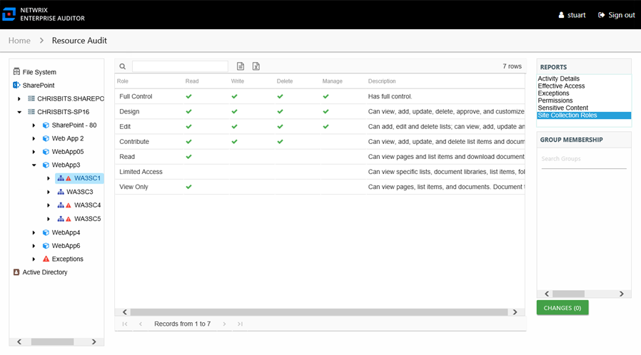

# Site Collection Roles Report

The Site Collections Roles report at the site collection level provides a list of all roles or permission levels for the selected site collection, including custom defined roles and role descriptions. It also displays a calculation of the actual rights that each role grants within the targeted SharePoint on-premise farm or SharePoint Online instance.

**NOTE:** This report is only available at the site collection level.

This report is comprised of the following columns:

* Role – Role name for the SharePoint permission level
* Description – Description of the SharePoint role, this is an open text entry within SharePoint and may not accurately represent the granular rights granted through the SharePoint permission level
* Permission Mask – Representation of the granular rights mapped to the permission level in SharePoint

The following rights are a normalized representation of the SharePoint permission levels (SharePoint Roles) granted to the trustee:

* Read – Right to view/read SharePoint resources
* Write – Right to add or modify SharePoint resources
* Delete – Right to delete SharePoint resources
* Manage – Equivalent to full control over SharePoint resources