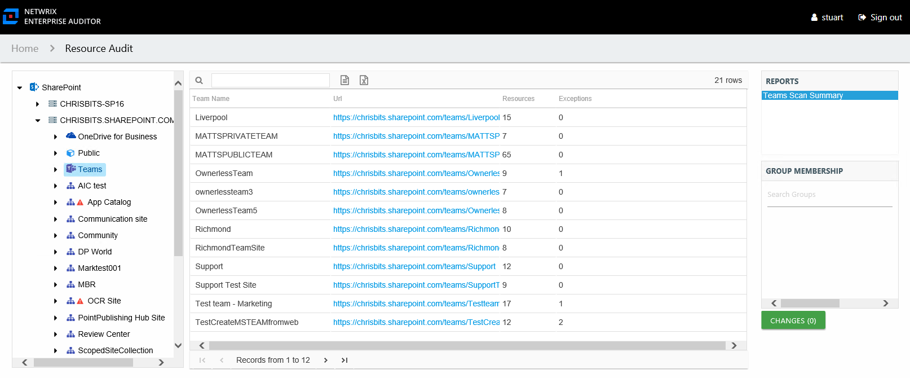

# Teams Scan Summary

The Teams Scan Summary report at the **Teams** node provides an overview of scanned Teams servers.

This report is comprised of the following columns:

* Team Name – The name of the teams that show up under the node, these are site collection resources
* Url – URL path to the resource
* Resources – Count of resources within the site collection
* Exceptions – Count of exceptions within the site collection