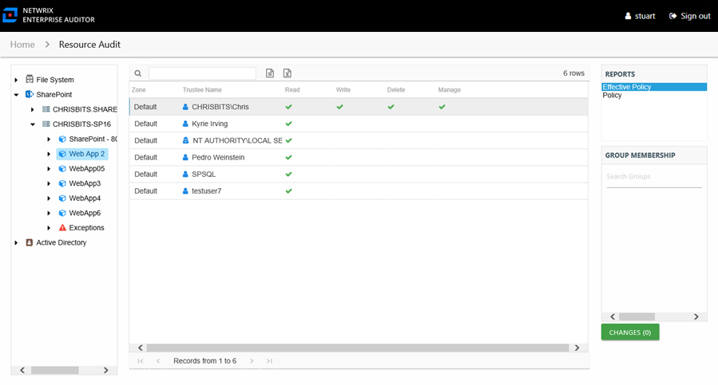

# Effective Policy Report

The Effective Policy report at the web application and web application URL levels provides a list of users and groups who are effectively granted or denied access to the SharePoint on-premise farm web application through a particular web application policy with the rights being either granted or denied.

This report is comprised of the following columns:

* Zone – Zone to which the policy is applied (for example, internet, intranet, default, and so on)
* Url – URL path to the site collection
* Trustee Name – Owner of the trustee account
* Trustee Account – Active Directory account associated with the trustee
* Department – Department to which the trustee account belongs
* Title – Trustee’s title as read from Active Directory
* Mail – Trustee’s email account as read from Active Directory
* EmployeeId – Corporate ID for the employee as read from Active Directory
* Description – Description of the trustee object as read from Active Directory
* DistinguishedName – Distinguished name for the trustee account
* ObjectSid – Security ID of the object
* Disabled – True or False if trustee account is disabled
* Stale – True or False if trustee account is stale (according to the length of inactive time used by the Access Analyzer data collection and analysis configuration to identify stale accounts)
* Deleted – True or False if trustee account is deleted

The following rights are a normalized representation of the SharePoint permission levels (SharePoint Roles) granted to the trustee:

* Read – Right to view/read SharePoint resources
* Write – Right to add or modify SharePoint resources
* Delete – Right to delete SharePoint resources
* Manage – Equivalent to full control over SharePoint resources

If the selected trustee in the top section of the report is a group, the Group Membership pane displays the group membership, including nested groups.

To view the granular rights granted through SharePoint permission levels (SharePoint Roles), see the **Roles** column in the [Permissions Report](../SiteCollections/Permissions "Permissions Report"). For additional detail on what permissions each SharePoint Role grants, see the **Permission Mask** column in the [Site Collection Roles Report](../SiteCollections/SiteCollectionRoles "Site Collection Roles Report").