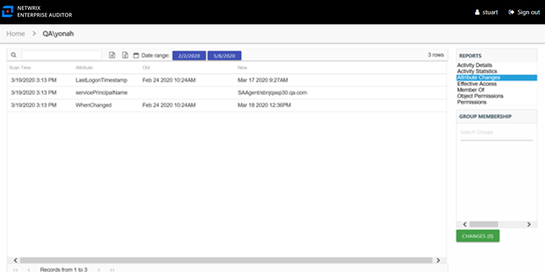

# Attribute Changes Report

The Attribute Changes report for a user object provides specific details for every attribute change to the audited user during the selected date range.

This report is comprised of the following columns:

* Scan Time – Date and timestamp of the Access Analyzer scan that identified the change
* Attribute – Active Directory attribute changed for the user
* Old – Original attribute value
* New – New attribute value